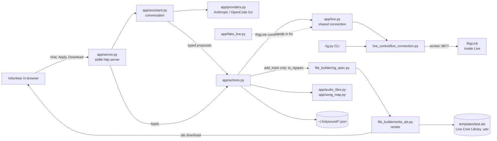

# Architecture

Holy Sound turns a plain-English conversation about a church's Sunday into an Ableton Live session. It has two ways of producing that session (write a `.als` file, or drive a running Live) and a web app that sits in front of both.

## Two backends

| | File renderer | RigLink runtime driver |
|---|---|---|
| Code | `file_builder/` | `ableton_script/RigLink/` (inside Live), `live_control/live_connection.py` (client), `rig.py` (CLI) |
| Needs Live running | No (needs Live's install folder to copy stock devices) | Yes, with RigLink enabled as a Control Surface |
| Input | `RigSpec` (Pydantic) | Commands over a local socket (`localhost:9877`) |
| Output | `.als` bytes, a file you can email | Edits to the open set, no reopen |
| Scope today | Tracks: name, type, input, devices, volume, pan | Tracks, mixer, routing, effects, songs (scenes, tempo, transpose), markers, stem import |

The two do **not** share a vocabulary. RigLink does not consume `RigSpec`; see [Discrepancies](#discrepancies). Details: [file-renderer.md](file-renderer.md), [riglink.md](riglink.md), [cli-and-live-control.md](cli-and-live-control.md).

## How the pieces connect



Flow of one request:

1. The volunteer chats. `app/assistant.py` sends the conversation to a provider (`app/providers.py`) and gets back proposed **actions** (typed Pydantic models in `app/actions.py`). Nothing runs yet.
2. The volunteer presses Apply. Each action executes through the shared RigLink connection (`app/live.py`).
3. With Live closed, `Server.export` (`app/server.py`) calls `to_rigspec` (`app/actions.py`), which keeps only `AddTrack` actions, and `render()` returns a `.als` for download. Anything the file cannot hold becomes a note shown to the user.

Pages: [web-server-api.md](web-server-api.md), [assistant-and-actions.md](assistant-and-actions.md), [audio-analysis-and-memory.md](audio-analysis-and-memory.md), [frontend.md](frontend.md).

## Module map

| Path | What it is |
|---|---|
| `rig.py` | typer CLI over RigLink: track, mix, route, effect, song, marker |
| `ableton_script/RigLink/` | Control Surface that runs inside Live; socket server for live edits |
| `live_control/live_connection.py` | `LiveConnection`, client for RigLink |
| `live_control/stem_level.py` | Active RMS and peak of a WAV stem (stdlib); drives level matching on `song import` |
| `live_control/starting_fader.py` | Starting fader for tracks an import creates, so summed stems do not clip |
| `live_control/timecode.py` | Detects SMPTE/timecode stems |
| `live_control/stereo_pairs.py` | Pairs L/R stems |
| `file_builder/rig_spec.py` | `RigSpec` / `TrackSpec`, the contract |
| `file_builder/write_als.py` | `render(spec, template_path) -> bytes` |
| `app/server.py` | HTTP server, JSON API, `.env` loading, CLI flags |
| `app/assistant.py` | Claude conversation producing proposed actions |
| `app/providers.py` | Provider selection (Anthropic, OpenCode Go in OpenAI or Anthropic format), model discovery |
| `app/actions.py` | Proposable actions and how each runs; `to_rigspec` |
| `app/live.py` | Shared, self-reconnecting RigLink connection |
| `app/audio_files.py` | Folder browsing, WAV/AIFF level measurement |
| `app/room.py` | Room memory, `room.json` |
| `app/song_map.py` | Reads a song's stems as text (sections, tempo, likely lead vocal) |
| `app/folders.py` | Mixer folders and remembered moves, `folders.json` |
| `app/fake_live.py` | In-memory stand-in for Live + RigLink (`--fake-live`, tests) |
| `app/static/` | HTML/CSS/JS, served as-is |
| `tests/` | `unittest` suite (`test_app.py`, `test_providers.py`); needs neither Live nor an API key |
| `templates/` | Reference Live sets; read-only fixtures |
| `docs/` | `td_next.md` (ranked gaps) and this documentation |

## Design principles

- **The Rig Spec is the product.** `RigSpec` describes a session in human terms; backends are replaceable around it.
- **Intent, never parameters.** The model says "Compressor"; the renderer picks a stock preset. RigLink likewise never writes raw device parameters: volume and sends are set in dB by searching the parameter's own `str_for_value()` text, so Live's fader law is the only conversion.
- **Invalid states are unrepresentable.** The model hands over a whole spec and never calls `add_track()`, so it cannot break Live's structural invariants. The renderer also checks them before writing (see [file-renderer.md](file-renderer.md#invariants-and-where-they-are-enforced)).
- **Audience is a volunteer, not an engineer.** No JSON in the UI, no CLI, errors as sentences. Actions require an explicit Apply.
- **Stock Ableton devices only**, and dependencies limited to lxml, pydantic, typer, anthropic. The web server is stdlib `http.server`; OpenCode Go's Chat-format models go over stdlib `urllib`, its Anthropic-format models over the `anthropic` SDK.

## Runtime files

| File | Written by | Contents |
|---|---|---|
| `~/.holysound/room.json` | `app/room.py` | Room memory (interface, who is on which input, outputs) |
| `~/.holysound/folders.json` | `app/folders.py` | Remembered moves between mixer folders |
| `.env` (repo root) | the user | `ANTHROPIC_API_KEY` or `HOLYSOUND_PROVIDER`/`OPENCODE_API_KEY`/`HOLYSOUND_MODEL`; read by `load_dotenv` in `app/server.py` using `setdefault`, so real env vars win |

`$HOLYSOUND_HOME` overrides the `~/.holysound` directory for both JSON files.

## Running things

All from the repo root (imports are package-relative).

```sh
uv sync
ln -s "$PWD/ableton_script/RigLink" ~/Music/Ableton/User\ Library/Remote\ Scripts/RigLink
# Live: Preferences > Link/MIDI > pick RigLink as a Control Surface

uv run python -m app               # http://127.0.0.1:8765
uv run python -m app --lan         # bind 0.0.0.0, for phones
uv run python -m app --fake-live   # no Ableton
uv run python -m app --list-models # OpenCode Go models
uv run rig.py status               # is Live connected?
uv run python -m unittest
```

Editing RigLink requires quitting and reopening Live (it is imported once; symptom is `unknown cmd`). Client and `rig.py` edits do not. More in [testing-and-development.md](testing-and-development.md).

## Discrepancies

- `CLAUDE.md` says RigLink does not consume `RigSpec`. The docstrings in `ableton_script/RigLink/__init__.py` and `live_control/live_connection.py` say its commands match or take "RigSpec-shaped intent". The code path in the app confirms the former: only `to_rigspec` bridges the two, and only for `AddTrack`.
- Fixtures in `templates/` are `chmod a-w` locally, but git doesn't store that bit; re-run `chmod a-w templates/*` after a fresh clone.
- `pyproject.toml` names the project `rigforge` although the product is "Holy Sound".
