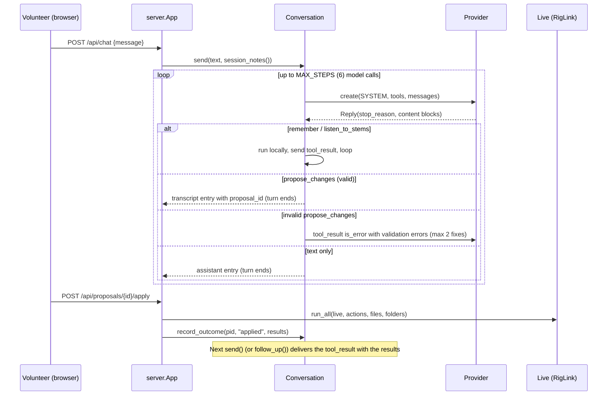

# Assistant and Actions

The chat layer of the web app. `app/assistant.py` runs the conversation, `app/providers.py` talks to whichever model answers, and `app/actions.py` defines the typed changes the model may propose and how each is carried out against Live through RigLink. See [web-server-api.md](web-server-api.md) for the HTTP endpoints that drive this, [riglink.md](riglink.md) for the commands actions call, and [audio-analysis-and-memory.md](audio-analysis-and-memory.md) for `song_map` and room memory.

## End-to-end flow

1. `App.send_message` (`app/server.py`) builds the session notes (`App.notes` -> `session_notes`) and calls `Conversation.send(text, notes, attachment)`. Only one turn runs at a time (`_lock`); `/api/chat` rejects a message while `busy`.
2. Each user message sent to the model is `<session>\n{notes}\n</session>\n\n{text}` plus an optional attachment (an imported folder's measurements; not shown in the chat transcript).
3. The model answers with text and/or one tool call. History is kept in Anthropic content-block format regardless of provider (`_replayable` copies response blocks back verbatim, dropping `parsed_output`).
4. `propose_changes` is validated with `Proposal.model_validate`. If valid, a proposal record is stored (`status: "pending"`) and the turn **ends there**. The tool call stays open (`_open_tool_use = (tool_use_id, proposal_id, other_results)`); nothing reaches Live.
5. The volunteer presses Apply, Dismiss, or Download (export to `.als`). `App.apply` runs `run_all`, then `Conversation.record_outcome`. The `tool_result` is only built on the *next* `_send`, via `_tool_result`, so the model learns what happened (lines prefixed with check or cross, plus any `detail`).
6. If the batch contained a `Listen` action, `App.apply` immediately calls `Conversation.follow_up(notes)`, which sends the results with an "(Automatic: ...)" body so the model can read the meter numbers without a new message.

### Proposal lifecycle

| Status | Meaning |
| --- | --- |
| `pending` | Shown with Apply / Dismiss / Download. |
| `applied` | `run_all` finished; per-action `results` stored. |
| `dismissed` | Volunteer declined. |
| `exported` | Downloaded as `.als` instead (`App.export`, only if still pending). |
| `superseded` | A newer proposal was made, or the volunteer sent another message first. Cannot be applied (`App._pending` raises "already been dealt with"). |

### Loop rules (`Conversation._send`)

- `MAX_STEPS = 6` model calls per message; `FIX_ATTEMPTS = 2` validation retries. After the limit, the dangling tool call is answered ("Stopped here...") and the volunteer sees a generic apology.
- Every tool call gets a `tool_result`, in order. Unknown tool name -> error result. Non-dict input (provider returned unparseable JSON) -> error asking to resend.
- One `propose_changes` per reply; extra calls get `ONE_PROPOSAL` back.
- `stop_reason == "refusal"` -> `_Refused`; history is rewound and the volunteer sees "Sorry, I can't help with that one."
- Any other exception (including `AssistantUnavailable`) rewinds history (`_rewind`), removes the user entry from the transcript, and re-raises, so a failed turn leaves no trace and the message can be resent.
- If a text reply accompanies a tool call that is not `propose_changes`, it is shown as its own entry; with a proposal, the text is attached to the proposal entry.
- Token usage accumulates in `Conversation.usage` via `token_usage(response)` and is published as a `usage` feed event.

### ReplyFeed (streaming to the page)

`Conversation.feed` is a `ReplyFeed`: a thread-safe event list (`start`, `step`, `thinking`, `text`, `tool`, `usage`, `end`) of the current turn only. `/api/events` streams it. `cursor()` lets a page that connects mid-turn replay from the turn start. `busy` is cleared *before* `end` is published so a refreshing page sees the finished turn.

## System prompt and context

Two layers, both in `app/assistant.py`:

**`SYSTEM`** (constant, sent as the system prompt every call; cached on Anthropic via `cache_control: ephemeral`). 37 numbered rules in sections: how to talk (short, plain sentences, no JSON/IDs, offer don't instruct), how changes happen (propose only; never claim done until a check-marked result), tool values and limits (dB, pan, "can't change effect settings / group tracks / delete clips / move Master"), importing audio, mixing guidance (click to in-ears, SMPTE muted, stereo pair rules, folders), remembering, safety (`listen`, `start_song`, `transport` make sound), and listening to stems. The colour list is interpolated from `rig.TRACK_COLORS`.

**`<session>` notes** (rebuilt by `session_notes(snapshot, stock_devices, live_error, imports, room)` on every user message; the prompt tells the model to trust these over earlier chat):

| Section | Source |
| --- | --- |
| Live connected? tempo, time signature, playing/stopped; or "Live is NOT connected (reason)" | `snapshot["song"]` / `live_error` |
| `Tracks:` numbered, one line each via `_strip_line`: name, folder, colour name (`color_name`, nearest of `TRACK_COLORS`), audio/MIDI, input, output, volume, pan, MUTED/SOLO, effects, sends, clips per song with gain | snapshot + `FolderMemory` (`App.with_folders`) |
| `Returns (shared effects):` lettered A, B, ... | snapshot |
| `Songs (scenes):` index, name, BPM, transpose (`transposed +2`, or "clips at mixed keys" when `transpose` is `None`) | snapshot scenes |
| `Outputs:` `Master; Ext. Out ...` from `ext_outputs`; falls back to outputs in use with a "ask which ones feed in-ears" hint for older RigLink | `_outputs_line` |
| `Imported audio folders (...)` name and file count | `App.imports` |
| `Stock devices in this Live:` by category; `FALLBACK_DEVICES` when Live is down or lists none | `App.live.stock_devices()` |
| `What you remember about this church` (`#id. fact`), last | `RoomMemory.notes()` |

Song maps (`app/song_map.py`) are **not** in the notes. They are produced on demand by the `listen_to_stems` tool and returned as a tool result.

## Tools given to the model

Defined by `_tools()` in `app/assistant.py`. Schemas come from pydantic `model_json_schema()` passed through `_inline_refs`, which inlines `$ref`/`$defs`, drops `discriminator`, rewrites `oneOf` to `anyOf`, and adds a one-value `enum` beside any `const` (to keep open models via OpenCode Go on schema they follow).

| Tool | Input model | Runs | Effect |
| --- | --- | --- | --- |
| `propose_changes` | `actions.Proposal`: `actions` list, 1 to 150 items, discriminated on `action` | Not run directly; stored as a pending proposal | Deferred until Apply. Result arrives next turn. |
| `listen_to_stems` | `ListenToStems`: `song` (name/number in the open set) and/or `files` (up to 64 imported file ids or a subfolder prefix) | `Conversation._listen` immediately | Resolves stems via `Conversation.song_stems` (set by `App.song_stems`, which calls RigLink `song_files`) or `Conversation.files` (imported-file id -> path; the model can only read these), then `song_map.listen(stems)`. Plays nothing, no Apply. Adds a `heard` note entry to the chat. |
| `remember` | `Remember`: `facts` (up to 20 short sentences) and `forget` (fact numbers) | `Conversation._remember` immediately | `room.remove(forget)` then `room.add(facts)`; adds a `note` entry. Returns "Memory isn't available" if `room is None`. |

`listen_to_stems` (offline file analysis) is distinct from the `listen` *action* (plays a scene in Live and reads output meters).

## Providers (`app/providers.py`)

A provider exposes `create(system, tools, messages, on_event=None) -> Reply(stop_reason, content, usage)` and a `session_id` attribute (set by `Conversation._create` each call). `Reply.content` is a list of Anthropic-style block dicts, so the conversation never knows who answered. `Conversation.client()` wraps a bare Anthropic SDK client (anything lacking `.create`) in `AnthropicProvider`; tests inject a `client_factory`.

| Provider | Transport | Used for |
| --- | --- | --- |
| `AnthropicProvider(gateway=False)` | `anthropic` SDK `client.beta.messages.stream` | Claude directly. Prompt caching on the system block, adaptive thinking with summarized display, `output_config.effort`, `disable_parallel_tool_use`, beta `server-side-fallback-2026-07-01` with `fallbacks="default"`. |
| `AnthropicProvider(gateway=True)` | `anthropic` SDK `client.messages.stream` against OpenCode Go's root URL | OpenCode Go models that speak Anthropic Messages (Qwen, MiniMax). Plain request only, with `x-opencode-session` header. |
| `OpenAIChatProvider` | stdlib `urllib.request` POST to `{base}/chat/completions`, SSE streaming | OpenCode Go models that speak Chat Completions (Kimi, GLM, DeepSeek, MiMo). `opener` is injectable for tests. |

`MAX_TOKENS = 16000`, `REQUEST_TIMEOUT = 180` s (chat provider).

### Choosing a provider

`chosen_provider_name(env)`: `HOLYSOUND_PROVIDER` if set (`anthropic`, `opencode-go`, or alias `opencode`); else `anthropic` if `ANTHROPIC_API_KEY` is set; else `opencode-go` if `OPENCODE_API_KEY` is set; else `anthropic`. `provider_from_env` is called lazily by `Conversation.client()` on first use (not at server start), so a missing key surfaces in `App.ai_state` as a sentence rather than crashing. `.env` is loaded by `server.load_dotenv` (`os.environ.setdefault`, so real env wins).

| Variable | Default | Meaning |
| --- | --- | --- |
| `HOLYSOUND_PROVIDER` | auto (above) | `anthropic` or `opencode-go`; anything else raises `AssistantSetupError`. |
| `ANTHROPIC_API_KEY` | none | Anthropic key. |
| `HOLYSOUND_MODEL` | `claude-opus-5-5` (Anthropic); `kimi-k3` or first Chat model (OpenCode Go) | Model id. |
| `HOLYSOUND_EFFORT` | `medium` | Anthropic only. |
| `OPENCODE_API_KEY` | none | OpenCode Go key. |
| `HOLYSOUND_BASE_URL` | `https://opencode.ai/zen/go/v1` | OpenCode Go base URL. |

`uv run python -m app --list-models` prints `list_models_text()` and exits.

### OpenCode Go model discovery

`discover_models()` returns `({model id: format}, is_live)`, cached per process (`refresh=True` bypasses):

1. GET `{base}/models` (4 s timeout) for the ids. On any `OSError/ValueError/KeyError/TypeError`, return `FALLBACK_MODELS` with `is_live=False`.
2. GET `https://models.dev/api.json`; `models_dev_formats` reads provider `opencode-go`, mapping each model's npm package to a format (`@ai-sdk/openai-compatible` -> chat, `@ai-sdk/anthropic` -> messages, `@ai-sdk/openai` -> responses). If models.dev fails, use `guess_format` by family name.

Formats: `chat`, `messages`, `responses`. **Responses-only models (grok, gpt-*-luna, ...) are rejected** with an `AssistantSetupError` telling the volunteer to pick another. If discovery is live and the chosen model isn't listed, that is also a setup error. OpenCode Go does not translate between formats, so each model is called in its own.

### Format conversion for Chat Completions

`chat_messages` converts Anthropic-shaped history: `tool_result` blocks become `role: tool` messages (prefixed `Error: ` when `is_error`), text blocks merge into one user message, assistant `tool_use` becomes `tool_calls`, and `thinking` blocks are sent back as `reasoning_content` (thinking models want it). `chat_tool` wraps each tool as an OpenAI function. Requests set `parallel_tool_calls: False`, `stream: true`, `stream_options.include_usage`. `read_chat` accepts either SSE or a plain JSON body (some services ignore `stream`); `chat_stream` reassembles chunks and emits `thinking`/`text`/`tool` events; `chat_reply` maps `finish_reason` (`tool_calls`->`tool_use`, `stop`->`end_turn`, `length`->`max_tokens`, `content_filter`->`refusal`) and forces `tool_use` if any tool call is present. Malformed tool-call arguments are kept as the raw string; the conversation answers with an error and asks again.

### Errors

All provider failures become `AssistantUnavailable` with a volunteer-readable sentence; key/model problems are the subclass `AssistantSetupError` (the conversation records it in `setup_error`, and `ai_state` reports not ready). `assistant.py` re-exports `AssistantUnavailable`.

| Condition | Result |
| --- | --- |
| Anthropic auth/permission error, or SDK `TypeError` mentioning "authentication" (missing key) | `AssistantSetupError` (`bad_key` / `not_set_up`) |
| Anthropic `RateLimitError` / HTTP 429 | `AssistantUnavailable(BUSY)` |
| `APIConnectionError`, `URLError`, timeout, `ConnectionError` | `AssistantUnavailable(UNREACHABLE)` |
| Other API status / mid-stream error | `AssistantUnavailable` with status or "stopped part-way" |
| Chat HTTP 401/403 | `AssistantSetupError` |
| Chat HTTP 5xx | `AssistantUnavailable` ("Couldn't reach the AI model right now") |
| Other chat 4xx | `AssistantUnavailable` including the error body's message (`_error_message`, OpenAI or Anthropic shaped) |
| Non-JSON / empty / error chunk in stream | `AssistantUnavailable` |

## Actions (`app/actions.py`)

Each action is a pydantic model with a `Literal` `action` discriminator, `describe()` (the sentence shown in the step list) and `run(ex)` (returns the result sentence, or raises `ActionFailed`). Actions carry intent only (names, dB, stock device names), never raw parameters.

**References.** Tracks (`TrackRef`): exact name (case-insensitive), 1-based number, return letter `A`/`B`, or a name ignoring Live's `A-` prefix. Songs (`SongRef`): name or 1-based number. Both resolve against the live set *when the action runs*, so a later action can use a track an earlier one created (the executor caches track lists and clears the cache after structural changes). Ambiguous or missing names raise `ActionFailed` with the list of valid names.

**Shared types.** `Device{device, preset?}`; `Output{destination: "Master"|"Ext. Out"|"Sends Only", channel?}`; `InputChannel` is regex `^\d{1,2}(/\d{1,2})?$`; `ColorName` is a `Literal` of `rig.TRACK_COLORS` keys; `FolderKey` is a `Literal` of `app.folders.KEYS`. Level fields: fader/send `-70..6` dB, clip gain `-70..24` dB, pan `-1..1`, BPM `20..999`.

Flags: `destructive` (ClassVar, shown as "removes" tag in the UI) and `audible` ("plays out loud" tag). `Transport.audible` is a property that is true only when `playing`.

| `action` | Fields | Runs (RigLink cmd) | Notes / validation | Flags |
| --- | --- | --- | --- | --- |
| `add_track` | `name` (1-64), `kind` audio/midi (default audio), `input?`, `output?`, `volume_db?`, `pan?`, `devices[]`, `color?` | `create_audio_track` / `create_midi_track`, then `set_routing` (input: `Ext. In` or `No Input`; output), `set_volume`, `set_mute`, `set_pan`, `set_track_color`, `load_device` | Sub-steps are best-effort via `try_step`: the track is created even if a sub-step fails, and the result reads "Added ... But couldn't ...". Audio tracks with no `volume_db` get `ex.new_track_fader_db` if the batch imports audio. Timecode-named tracks are muted in that case. Only action that can be exported to `.als`. | |
| `add_return` | `name`, `devices[]` | `create_return_track`, `load_device` | Returns lettered by index. | |
| `rename_track` | `track`, `new_name` | `set_track_name` | Also renames in `FolderMemory` so folder moves follow. | |
| `delete_track` | `track` | `delete_track` | Result tells user Cmd+Z in Live restores it. | destructive |
| `set_volume` | `track`, `db` | `set_volume` | Any track or return. | |
| `set_pan` | `track`, `pan` | `set_pan` | | |
| `set_mute` | `track`, `on` | `set_mute` | | |
| `set_solo` | `track`, `on` | `set_solo` | | |
| `set_input` | `track`, `input` (null = off) | `set_routing` direction input | Returns not allowed (`allow_return=False`). | |
| `set_output` | `track`, `output` | `set_routing` direction output | `channel_name` passed through; Live validates the names. | |
| `set_send` | `track`, `to_return`, `db` | `set_send` | Fails with a sentence if `to_return` is not a return track. | |
| `add_device` | `track`, `device{device, preset?}` | `load_device` | Appended at end of chain. A missing preset falls back to the device default with a note (`Executor.load_device`, matches RigLink's "no preset called" error). Any other load failure raises. | |
| `remove_device` | `track`, `device` (name on the track) | `list_devices`, `delete_device` | Case-insensitive; removes the **last** matching device. Error lists the devices present. | destructive |
| `set_tempo` | `bpm` | `set_tempo` | Whole-set tempo. | |
| `add_song` | `name`, `bpm?` | `create_scene` | Songs are scenes. | |
| `update_song` | `song`, `new_name?`, `bpm?` | `set_scene` | Null keeps the field. | |
| `transpose_song` | `song`, `semitones` (-12..12) | `transpose_song` | Fails ("has no audio clips") if RigLink reports zero clips. 0 resets. | |
| `delete_song` | `song` | `delete_scene` | | destructive |
| `start_song` | `song` | `fire_scene` | Launches the scene. | audible |
| `transport` | `playing` | `play` / `stop` | | audible when playing |
| `set_color` | `track`, `color` | `set_track_color` | RGB from `TRACK_COLORS`. | |
| `move_to_folder` | `track`, `folder` | `FolderMemory.move`, then `set_track_color` | Fails if `ex.folders is None`. Folder is app-side memory only; Live shows it as the folder's colour (colour failure is a partial "But"). Returns not allowed. | |
| `import_audio` | `track`, `file`, `song`, `gain_db?` (-70..24) | `import_audio` | `file` must be an id from `Executor._files` (imported folders); resolved case-insensitively, never an arbitrary path. Needs an empty slot. | |
| `set_clip_gain` | `track`, `song`, `db` | `set_clip_gain` | Clip gain, not the fader. | |
| `listen` | `song?`, `seconds` (3-30, default 10) | `get_song`, `fire_scene`, `reset_meters`, sleep, `get_meters`, `stop` | Fails if no song given and nothing is playing. Stops playback afterwards only if it started it. Sets `ex.detail` to a meter report (peak/average per track, Live's 0-1 meter scale, not dB). Blocks the apply request for the whole duration. | audible |

### Execution (`run_all`, `Executor`)

- `run_all(live, actions, files, on_touch, folders)` runs actions **in order, with no rollback**. A failed action yields `{"ok": False, "text": "<describe>: <reason>"}` and the rest continue.
- `LiveUnavailable` (lost connection) aborts: that action and every remaining one are reported as failed ("not done — lost touch with Live.").
- Success results are `{"ok": True, "partial": " But " in text, "text": ..., "detail"?}`. A result containing " But " is partial success. `detail` carries extra facts for the model only (the `listen` meter report); `_tool_result` forwards it.
- Bulk-import fader rule: if any action is `import_audio`, `ex.new_track_fader_db = starting_fader_db(max stems per song)`, so new audio tracks start low enough that all stems together don't clip, unless the model set `volume_db`.
- `Executor.call` wraps `RigLinkError` in `ActionFailed` using `_sentence`, which rewrites terse RigLink messages (`no input called ... (options: ...)`, `no stock device called`, `index out of range`) into sentences.
- There is no undo. Safety comes from the approval step and the `destructive`/`audible` tags; `delete_track`'s message points to Cmd+Z in Live.
- `on_touch(name)` is called for each track an action works on so the page can highlight it (`App.touch`).

### Export to `.als`

`to_rigspec(actions)` converts only `AddTrack` actions to a `RigSpec` (see [file-renderer.md](file-renderer.md)) and returns notes for everything dropped: other actions ("only works with Live open"), stereo inputs, non-Master outputs, colours, and presets (default settings used). Returns `(None, notes)` if there are no tracks. `describe_proposal` sets `exportable` when any action is `add_track`.

## Adding a new action

1. **RigLink command** (if needed): implement in `ableton_script/RigLink/__init__.py`, add a client method in `live_control/live_connection.py` and optionally a `rig.py` command (see [riglink.md](riglink.md), [cli-and-live-control.md](cli-and-live-control.md)). Remember Live must be restarted after RigLink edits. Older-RigLink handling is the caller's job (`unknown cmd` surfaces through `_sentence` as "Live said: ...").
2. **`app/actions.py`**: add a `BaseModel` with `action: Literal["your_action"]`, constrained fields with `Field(description=...)` (descriptions are the model's documentation), `describe()`, and `run(ex)` returning a sentence. Use `ex.track(...)`/`ex.song(...)` to resolve references, `ex.call(...)` for RigLink, raise `ActionFailed("sentence")` for failures. Set `destructive: ClassVar[bool] = True` or `audible: ClassVar[bool] = True` as appropriate.
3. **Add the class to the `Action` Union.** The `Proposal` schema, discriminator and the tool schema all derive from it.
4. **`SYSTEM` prompt** in `app/assistant.py`: add or amend a rule so the model knows when to use it, and remove any "you can't ..." rule it contradicts (rule 18 lists current limits). Rule 34 lists audible actions.
5. **Session notes**: if the model needs to see new state to use the action well (like song transpose), extend `session_notes` / `_strip_line`, and the RigLink snapshot (`App.live.snapshot()` in `app/live.py`).
6. **Fake Live**: add the command to `app/fake_live.py` so tests and `--fake-live` demo work.
7. **Export**: if the action should appear in a `.als`, handle it in `to_rigspec` (and the renderer); otherwise it is reported as "only works with Live open" automatically.
8. **Tests** in `tests/test_app.py` (pattern: `run_actions({...})` against fake Live, plus a `Proposal.model_validate` rejection case); see [testing-and-development.md](testing-and-development.md).
9. **Docs**: `CHANGELOG.md`, and this table.

No frontend change is needed for a normal action: the UI renders `describe_proposal` output (`text`, `destructive`, `audible`) generically. The mixer's direct-command allowlist in `app/server.py` (`transpose_song` appears there too) is separate from actions; it covers only controls the page calls without the assistant.

## Discrepancies

- `CLAUDE.md` says the Anthropic SDK is "for the chat" without mentioning the provider layer, discovery via models.dev, or the `server-side-fallback` beta; these exist only in `app/providers.py`.
- `app/assistant.py`'s module comment says "the model, effort and provider come from .env, read when the AI is first used"; correct, but `load_dotenv` runs in `server.main`, so using `Conversation` outside the server (tests, scripts) reads only the real environment.
