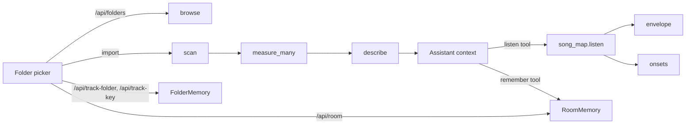

# Audio analysis and memory

Four stdlib-only modules in `app/` give the assistant ears and a memory: `audio_files.py` (browse folders, parse WAV/AIFF, measure levels), `song_map.py` (turn a song's stems into a text report), `room.py` (remembered room facts) and `folders.py` (mixer folder classification, remembered moves, and which tracks keep their key on transpose). Four more analyse a song at import time (`song_key.py`, `vendor_set.py`) or build its part tracks (`parts.py`, `mixdown.py`); they are covered in [Part tracks, imports, key and transpose](part-tracks-and-imports.md). Per-song mixes and checkpoints (`song_mixes.py`) are covered in [Web server API](web-server-api.md). The assistant cannot hear, so everything here converts audio or state into text or numbers it can read. See [Assistant and actions](assistant-and-actions.md) for how the output is used and [Web server API](web-server-api.md) for the endpoints.



## `app/audio_files.py`

### Folder browsing and path safety

| Symbol | Behaviour |
| --- | --- |
| `roots()` | Home, then `~/Music`, `~/Desktop`, `~/Downloads`, `~/Documents` if they exist, then every non-hidden directory in `/Volumes`. Shown as shortcuts in the picker. |
| `allowed(path)` | Resolves the path (following symlinks) and requires it to be inside `Path.home()` or `/Volumes`. Anything else, including `/`, is refused. |
| `_checked_folder(path)` | `expanduser().resolve()`, then `allowed`, then `is_dir`. Raises `AudioFileError` with a sentence on failure. Used by `browse` and `scan`. |
| `browse(path=None)` | One level only. Default folder is `~/Music` if present, else home. Skips dotfiles. Returns `path`, `display` (`~/...` when under home), `name`, `parent` (None if the parent is not allowed), `roots`, `folders` (each with `name`, `path`, `audio` = count of audio files directly inside) and `audio` (file names). Permission errors become an `AudioFileError`. |
| `scan(path)` | `os.walk` below a folder, at most `MAX_DEPTH = 3` levels deep, at most `MAX_FILES = 200` files, sorted case-insensitively, dotfiles skipped. Returns `(folder, [(id, abs_path)])`. The id is `"<folder name>/<relative path>"`, e.g. `Sunday Stems/Way Maker/Click.wav`. This id is what the assistant sees and what `listen` matches against. |

Audio extensions (`AUDIO_EXTENSIONS`): `.wav .wave .aif .aiff .aifc .mp3 .m4a .flac .ogg`. Only `MEASURABLE` (`.wav .wave .aif .aiff .aifc`) are measured; others are listed with `measured: False`.

`AudioFileError` messages are written for the volunteer (for example "Holy Sound can only look in your home folder and attached drives."); the server wraps them in `UserError`.

### Parsing

`_wav_header` and `_aiff_header` walk the chunk list, return a dict (`container`, `kind` int/float, `channels`, `rate`, `bits`, `big_endian`, `offset`, `length`) and stop at the data chunk. `_frames` trusts the real file size over the header length, so truncated files and streaming headers still read.

| Format | Accepted | Rejected (`measured: False`, with a `problem`) |
| --- | --- | --- |
| WAV | RIFF/WAVE, PCM (tag 1) and IEEE float (tag 3), including `WAVE_FORMAT_EXTENSIBLE` (tag read from the sub-format). Little endian. | Any other tag: "compressed WAV". Missing RIFF/WAVE header: "not a WAV file". `data` before `fmt `. |
| AIFF / AIFF-C | `FORM`/`AIFF` or `AIFC`; AIFC compression `NONE`, `sowt` (little-endian PCM), `fl32`/`FL32` (float). 80-bit extended sample rate decoded by `_extended`. | Other AIFC compression: "compressed AIFF". |
| Bit depths | int 16, 24, 32; float 32, 64. | Anything else raises "`N`-bit `kind` audio" from `_decoder`. 8-bit int is rejected. |

`_decoder` returns `(decode_fn, full_scale)`. 16/32-bit and float use `array.array` with `byteswap` when endianness differs from the host. 24-bit is widened to 4 bytes by strided slice assignment (no Python loop) so the sample sits in the top 24 bits of a native int; its full scale is therefore `2**31`.

### The measures

All use dBFS (`20*log10(linear/full_scale)`); `_db(0)` is `-inf`.

| Function | Algorithm | Constants | Output |
| --- | --- | --- | --- |
| `_rms(values, full_scale)` | RMS estimated from a strided subsample of one window | `SAMPLES_PER_WINDOW = 2048` (stride = `len // 2048`) | linear, 0..1 |
| `_loudness` (via `measure`) | Reads the whole file in `WINDOW_SECONDS = 0.4` windows. Peak = max absolute sample over every full-resolution sample (not subsampled). Windows with RMS above `SILENT_DB = -60` are "sounding". | `loud_dbfs` = 90th percentile of the sorted sounding-window RMS values (`sorted[int(n*0.9)]`, clamped). `sounding_pct` = sounding windows / all windows. | `format`, `measured`, `seconds`, `channels`, `sample_rate`, `silent`, `peak_dbfs`, `loud_dbfs`, `sounding_pct` (the last two absent when silent) |
| `envelope(path, seconds)` | dBFS RMS per window of given length | window supplied by caller (`song_map` uses 1.0 s) | list of dB, `-inf` for empty windows, or `None` if unreadable |
| `onsets(path)` | Peak absolute value per `ONSET_SECONDS = 0.01` window; threshold is 30% of the file's max peak; a hit is a window that crosses the threshold from below, at least 0.1 s after the previous hit | | list of times in seconds, `[]` if silent, `None` if unreadable |

`measure(path)` caches by `(path, size, mtime)` in a module-level dict. `measure_many` measures in a `ProcessPoolExecutor` (up to 8 workers) only when four or more files are uncached; the cache is filled in the parent.

`describe(file_id, m)` formats one line per file for the assistant:

```
- "Sunday Stems/Click.wav" — 3:42, mono, 48 kHz WAV 24-bit, peak -3.1 dBFS, loud parts -18.4 dBFS, sounding 100% of the time
```

Silent files print `SILENT (nothing above -60 dBFS)`; files with peak >= -0.1 dBFS get a trailing `CLIPS`; unmeasurable files print `not measured (<problem>)`.

## `app/song_map.py`

`listen(stems)` takes `[(name, path)]` and returns one text report. The assistant calls it through its listen tool (`assistant.py`, which resolves a song's clips or imported file ids to paths). It reads files only; nothing plays.

### Pipeline

1. **Study each stem** (`_study`, cached by path/size/mtime). `audio_files.envelope(path, 1.0)` gives one dB value per second. A stem's "own loud level" is the 90th percentile of its non-silent seconds; a second counts as *sounding* if it is above `loud - SOUNDING_BELOW_LOUD` (15 dB), floored at `SILENT_DB`. Per-stem relative thresholds keep a quiet pad and a loud kick comparable, and keep bleed in a vocal mic from reading as singing. A fully silent stem gets floor `0.0`, so it has no sounding seconds. If the name matches `CLICK`, `_tempo` also runs.
2. **Merge stereo pairs** (`live_control/stereo_pairs.stereo_pairs`): L and R stems are OR-ed into one part named like `Loop L/R`.
3. **Runs** (`_runs`): consecutive sounding seconds become `(start, end)`. Gaps of `FILL_GAP_SECONDS = 4` or less are bridged; runs shorter than `SHORTEST_PART_SECONDS = 2` are dropped.
4. **Sections** (`_sections`), computed only over "musical" parts, i.e. names matching none of `CLICK`, `CUES`, `ROOM`:
   - for each second, the frozenset of parts playing; consecutive equal sets form a section;
   - sections shorter than `SHORTEST_SECTION_SECONDS = 6` are folded into the previous one, then equal neighbours are merged again;
   - if more than `MAX_SECTIONS = 30` remain, the shortest (not the first) is repeatedly merged into its predecessor;
   - sections with nobody playing are omitted.
   Each section is described by which parts came `in:` and went `out:` relative to the previous section.
5. **Tempo** (`_tempo`): from the click's `onsets`; needs at least 8 onsets and 4 gaps between 0.2 s and 2.0 s (30 to 300 BPM). Onsets are timed to the nearest 10 ms, so one gap can read 0.21 or 0.22 s when it is really 0.216. The median gap finds the beat, then the gaps within 15% of it are averaged to cancel the rounding (the median alone read a 139 BPM click as 136). BPM is `60 / mean(those gaps)` rounded to 0.1. If the BPM is above 140 the report adds an "or half" hint for eighth-note clicks. Only the first stem whose *name* matches `CLICK` and has a tempo is used (note `_study` tests `path.stem`, the report tests the display name).
6. **Lead vocal** (`_likely_lead`): voices are musical parts that do not match `INSTRUMENT` (`_is_voice`), so a stem named after a person counts as a voice. Each voice's total sounding time is summed. The lead is the voice with the most sounding time among those not matching `BACKING`; if all are backing, the top one. Voices whose names match no `VOCAL` word are reported as "taken to be a singer from the name alone". It is a heuristic: most-sung, not verified.

### Output shape

```
Listened to 6 stems (4:12 long).
Tempo from the click: about 72 BPM.

When each part sounds:
  BGV High: 0:48-1:02, 2:10-3:20
  Click: the whole song
  Lead Vox: 0:16-1:02, 1:20-3:40
  Pad: the whole song

Sections (where parts come in and drop out; click, cues and room mics left out):
  0:00-0:16  in: Pad
  0:16-0:48  in: Lead Vox
  0:48-1:02  in: BGV High
  1:02-1:20  out: BGV High, Lead Vox

Voices (sounding share of the song): Lead Vox 80%, BGV High 30%.
Probably the lead vocal: Lead Vox, who sings the most.
Couldn't listen to: Loop.mp3 (only WAV and AIFF).
```

(Illustrative, built from the format strings in `listen`; times are `m:ss`.) "the whole song" means one run starting within 5 s of the start and ending within 5 s of the end. `silent` is printed for a part with no runs. If no file is readable the report is a single sentence.

Name-matching regexes (`CLICK`, `CUES`, `ROOM`, `VOCAL`, `BACKING`, `INSTRUMENT`) are module constants; adjust them there. They are separate from the rules in `folders.py`.

## `app/room.py`: room memory

`RoomMemory` stores facts about the church (interface, who sings on which input, which outputs feed in-ears) so the second Sunday needs one sentence. Path: `$HOLYSOUND_HOME/room.json`, else `~/.holysound/room.json`.

```json
{
  "facts": [
    {"id": 1, "text": "Scarlett 18i20; vocals on inputs 1-4", "added": "2026-10-06"}
  ]
}
```

| Field | Meaning |
| --- | --- |
| `id` | Integer, monotonically assigned. On load `next_id = max(id) + 1`, so ids of deleted facts at the top can be reused after a restart. |
| `text` | Whitespace-collapsed, truncated to `MAX_LENGTH = 200`. |
| `added` | ISO date of creation. |

Semantics:

- `_load` silently starts empty on a missing or invalid file and drops entries that are not dicts or have no `text`.
- `add(texts)` skips empty texts and case-insensitive duplicates, stops at `MAX_FACTS = 60`, returns what it saved, and writes only if something was added.
- `remove(ids)` returns the removed facts and writes only if something was removed.
- Writes are atomic (`.tmp` then `replace`) under a `threading.Lock`; the parent directory is created on demand. The file is human-editable, but edits made while the app runs are not picked up until restart (it loads once at construction).
- `notes()` renders the facts as `  #id. text` lines under a header ("What you remember about this church ...", or "... nothing yet.") for the assistant's per-message context (`assistant.py`, which also applies the remember tool's `facts` and `forget` via `add`/`remove`).
- The UI's Room tab uses `POST /api/room` with `add` or `remove`; `GET` state includes `room.facts()`.

## `app/folders.py`: mixer folders

The mixer groups tracks into four folders, in this order (`FAMILIES`): `vocals` (Vocals, red), `instruments` (Instruments, blue), `playback` (Click & playback, teal), `other` (Other, grey). The colour names come from `rig.TRACK_COLORS`. Live cannot move tracks or create groups from a Control Surface, so a move also recolours the track (done by the page via `set_track_color`); colour is the only folder signal visible in Live.

### Classification by name

`classify(name)` tests case-insensitive regexes in order and returns the first match, else `other`:

| Order | Folder | Matches (abridged) |
| --- | --- | --- |
| 1 | `playback` | click, guide, cue, loop(s), playback, stem(s), smpte, timecode, backing track, track(s), sequence, metronome |
| 2 | `vocals` | vox, vocal, voc, bgv, bv, choir, singer, harmon, lead v, mic, speech, pastor, preacher, soprano, alto, tenor, announce |
| 3 | `instruments` | drums and parts (kick, snare, toms, hats, overhead, perc, cajon, ...), bass, guitars (gtr, acoustic, eg, ag, banjo, uke ...), keys (key, piano, organ, synth, pad, rhodes, strings, nord ...) |

Order matters: "Backing Track" hits playback before the `vocals` pattern could. See `_RULES` for exact patterns, which use word boundaries on short tokens.

### Remembered moves

`FolderMemory` persists manual moves by track name in `$HOLYSOUND_HOME/folders.json` (default `~/.holysound/folders.json`):

```json
{"moved": {"lead vox": "vocals", "tracks 1": "playback"}, "follows_key": {"pad": true}}
```

Keys are `casefold()`ed track names; values in `moved` must be one of the four family keys (others are dropped on load). `follows_key` holds a per-track choice, set by hand, about whether a song transpose moves the track (`true`) or leaves it alone (`false`); non-boolean values are dropped on load.

| Method | Behaviour |
| --- | --- |
| `folder_for(name)` | Remembered move if any, else `classify(name)`. Used by `server.with_folders` to add `folder` to every track in each snapshot. |
| `move(name, folder)` | Sets the override; `folder=None` removes it (back to name-based). Unknown key raises `ValueError` ("There's no folder called ..."). Writes immediately. |
| `rename(old, new)` | Carries a move and a key choice from the old name to the new. Called when a rename action runs (`actions.py`) and from the server's rename route. Writes only if either existed. |
| `keeps_key(name)` | True if a song transpose leaves this track alone. A hand-set choice wins; otherwise names matching click, guide, cue, count, SMPTE, timecode, LTC or metronome keep their key. |
| `set_follows_key(name, follows)` | Records the hand-set choice. Writes immediately. |
| `kept_tracks(tracks)` | Indexes of the rows (`index`, `name`) a transpose leaves alone; passed to RigLink as `skip_tracks`. |

Endpoints: `POST /api/track-folder` with `{track, folder}` (`move_to_folder` is also an assistant action) and `POST /api/track-key` with `{track, follows}`. Because moves are keyed by name, they apply to next week's set when the track names match. Same atomic-write and lock pattern as `RoomMemory`.

## Comparing the three loudness measures

| | `app/audio_files.py` `_loudness` | `live_control/stem_level.py` `stem_level` | `app/song_map.py` `_study` |
| --- | --- | --- | --- |
| Used by | Import summaries for the assistant (`describe`), `fake_live` clip loudness | `rig.py song import` clip-gain level matching (`_level_match_gains`) | `listen` reports |
| Formats | WAV 16/24/32 int, 32/64 float; AIFF, AIFF-C | WAV via `wave` module: integer PCM 16/24/32 only (no float, no AIFF); returns `None` otherwise | Same reader as `audio_files` |
| Window | 0.4 s | 0.4 s | 1.0 s |
| Within window | RMS from <= 2048 samples (stride varies with window length) | RMS from every 6th frame (`SAMPLE_STEP`) | same as `audio_files.envelope` |
| Silence cut | window RMS <= -60 dBFS excluded | window RMS <= -50 dBFS excluded | per-stem relative: sounding if above (p90 - 15 dB), absolute floor -60 |
| Loudness statistic | 90th percentile of sounding windows | RMS of the mean power across sounding windows (energy mean) | no level, only on/off per second |
| Peak | exact, all samples | from the same sparse sample set, can be about 1 dB low | not computed |
| Result | `loud_dbfs`, `peak_dbfs`, `sounding_pct` | `active_rms_db`, `peak_db` | boolean steps, BPM |
| Stereo | per file | `pair_level` combines two sides by mean power, max peak | merges L/R by OR |

Consequences:

- The first two give different numbers for the same stem. A percentile favours the loud passages; a mean-power average is pulled toward them but also includes quieter sounding windows, and has a different silence floor. What the assistant is told (`loud_dbfs`) and what actually gets applied as clip gain (`active_rms_db`) are therefore not the same quantity, so the assistant's reasoning about levels may not match what an import does.
- `stem_level` is narrower (WAV integer only); `audio_files` would also handle AIFF and float.
- `song_map` only needs relative activity, so its separate definition is justified; it does reuse the `audio_files` reader and `SILENT_DB`.
- Consolidation path (CLAUDE.md's open question): make `rig.py` use `audio_files` (it would need a peak/RMS per stem and a `pair_level` equivalent, and a decision on percentile vs power mean), then delete `stem_level.py`. Not done.

## Discrepancies

- CLAUDE.md says `app/audio_files.py` measures "90th percentile of 0.4 s windows" and `stem_level` "active RMS". Both true, but the silence floors differ (-60 vs -50 dBFS), which CLAUDE.md does not mention.
- CLAUDE.md describes `stem_level.py` as only driving `song import`; `fake_live.py` and the assistant use `audio_files` instead, so the app never uses `stem_level`.
- `HOLYSOUND_HOME` (used by `room.py`, `folders.py`, `song_mixes.py`, `imports.json` and the Parts folder) is not in CLAUDE.md, which names the `~/.holysound/` files (`room.json`, `folders.json`, `song_mixes.json`) but not the override.
- `app/mixdown.py` and `app/song_key.py` read audio through `audio_files` too, so they follow its WAV/AIFF support; `live_control/stem_level.py` is still the separate measure `rig.py song import` uses for clip gain.
