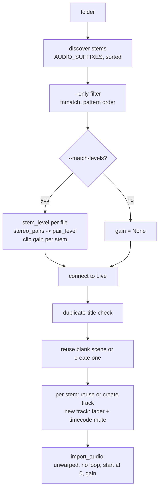

# CLI and Live Control Helpers

`rig.py` is a typer CLI that edits the open Live Set through RigLink. The four small modules in `live_control/` (`stem_level.py`, `starting_fader.py`, `timecode.py`, `stereo_pairs.py`) are pure functions that `song import` uses to decide gains, faders and mutes.

The socket client (`LiveConnection`, `RigLinkError`) and the in-Live script are documented in [riglink.md](riglink.md). The web app reaches the same RigLink commands through its own actions ([assistant-and-actions.md](assistant-and-actions.md)); the app reuses these helper modules too (`app/actions.py`, `app/song_map.py`, `app/folders.py`, `app/assistant.py` import from `live_control/`). For the system overview see [architecture.md](architecture.md).

Run from the repo root: `uv run rig.py <group> <command>`. Live must be open with RigLink selected as a Control Surface.

## How the CLI is built

- One root `typer.Typer` (`app`) plus six sub-apps added with `add_typer`: `track`, `mix`, `route`, `effect`, `song`, `marker`. All use `no_args_is_help=True`, so a bare group prints help.
- Every command opens its own `LiveConnection(timeout=30.0)` (`_connect`, used as a context manager) and closes it on exit. The 30 s timeout (`TIMEOUT_SECONDS`) exists because loading a device walks Live's browser tree.
- All RigLink calls go through `_run(call)`, which converts failures to sentences (see [Error behaviour](#error-behaviour)).
- Negative numbers (`-6`) would be read as options. `mix volume` and `mix send` set `ignore_unknown_options` via `NEGATIVE_NUMBERS`; `song transpose` sets the same flag inline. `mix pan` takes a string so it does not need it.

### Picking things by name or number

| Helper | Accepts | Behaviour |
| --- | --- | --- |
| `_pick(rows, choice, noun)` | 1-based number or case-insensitive name | Used for songs, markers, effects. Exact name match only (casefold). Ambiguous name -> fail, "use its number". Unknown -> fail listing the options. |
| `_resolve_track(live, choice)` | number, name, or return letter | Digits -> regular track by 1-based number (never a return). Otherwise names are matched across tracks **and** returns; more than one match fails. If no name matches and `choice` is a single letter, it is a return letter (`A` = first return). Returns `{index, is_return, label}`. |

Return tracks are labelled `A`, `B`, ... (`_return_letter`). `route in` is documented for "name or number" but goes through the same `_resolve_track`, so it also accepts letters.

## Command reference

Commands that take a `TRACK` accept a name, a 1-based number, or a return letter (see above) unless noted.

### Top level

| Command | Args / options | What it does | Example |
| --- | --- | --- | --- |
| `status` | none | Connects, prints tempo, time signature, playing/stopped. | `uv run rig.py status` |
| `play` | none | Start playback. | `uv run rig.py play` |
| `stop` | none | Stop playback. | `uv run rig.py stop` |
| `tempo` | `BPM` (float) | Set the global tempo now. A song's own tempo is `song tempo`. | `uv run rig.py tempo 72` |

### `track`

| Command | Args / options | Notes | Example |
| --- | --- | --- | --- |
| `track list` | none | One line per track: `index  name  (Audio\|MIDI)`, then returns as `A  name  (Return)`. Prints "This set has no tracks." if empty (and still loops over nothing). | `uv run rig.py track list` |
| `track add` | `[NAME]`, `--midi`, `--return` | Appends a track. `--midi` and `--return` together fails. | `uv run rig.py track add "Click"` / `track add Reverb --return` |
| `track rename` | `TRACK NAME` | | `uv run rig.py track rename 3 "Lead Vocal"` |
| `track color` | `TRACK NAME` | Colour is one of `TRACK_COLORS`: red, orange, yellow, green, teal, blue, purple, pink, grey (RGB ints). Live snaps to the nearest palette colour and recolours clips. Case-insensitive. | `uv run rig.py track color Click blue` |
| `track delete` | `TRACK` | Works on returns too. Undo in Live with Cmd+Z. | `uv run rig.py track delete "Old Pad"` |

### `route`

| Command | Args / options | Notes | Example |
| --- | --- | --- | --- |
| `route show` | `TRACK` | Prints current input (if the track has one; returns do not) and output, plus the types and channels each side can be set to. | `uv run rig.py route show Click` |
| `route in` | `TRACK SOURCE [CHANNEL]` | `SOURCE` and `CHANNEL` are strings **as Live displays them**, e.g. `"Ext. In"`, `"No Input"`, `"1"`. | `uv run rig.py route in Vox "Ext. In" 1` |
| `route out` | `TRACK DESTINATION [CHANNEL]` | Same idea, e.g. `"Ext. Out"`, `"Main"`, `"3/4"`. | `uv run rig.py route out Click "Ext. Out" 1` |

Both write through `LiveConnection.set_routing(index, "input"\|"output", source, channel, is_return)` and echo the resulting `type / channel`. Matching is done in RigLink, not here; see [riglink.md](riglink.md).

### `mix`

| Command | Args / options | Notes | Example |
| --- | --- | --- | --- |
| `mix show` | `TRACK` | Volume, pan, `muted`/`soloed` flags, and each send as `Send A (ReturnName): level`. Values are Live's display strings. | `uv run rig.py mix show 1` |
| `mix volume` | `TRACK DB` | Fader in dB; `-inf` for silent. | `uv run rig.py mix volume Click -6` |
| `mix pan` | `TRACK POSITION` | `C`/`CENTER`/`CENTRE`/`0`, or `25L`, `L25`, `50R`... Max 50. Converted by `_parse_pan` to -1..1 (`amount/50`). Bad input fails with a sentence. | `uv run rig.py mix pan Vox 25L` |
| `mix mute` | `TRACK [--off]` | `--off` unmutes. | `uv run rig.py mix mute Guide --off` |
| `mix solo` | `TRACK [--off]` | `--off` unsolos. | `uv run rig.py mix solo Click` |
| `mix send` | `TRACK TO DB` | `TO` must resolve to a **return**, else fails ("Sends only go to returns"). `-inf` for none. | `uv run rig.py mix send Vox A -12` |
| `mix levels` | `[--seconds 5.0]` | Calls `reset_meters`, sleeps `seconds`, then `get_meters`. Per row: `(no audio output)`, `silent` (peak == 0), or `peak x.xx, average x.xx`. Labels: track number, return letter, or `M` for master. Fails if `ticks == 0`. Values are Live's 0-1 meter scale (after fader, before mute); mapping to dB is unchecked per the docstring. Playback must be running for anything to register. | `uv run rig.py mix levels --seconds 10` |

Volume and send are set in dB inside RigLink by searching the parameter's own display text, so the CLI never converts to a gain factor.

### `effect`

| Command | Args / options | Notes | Example |
| --- | --- | --- | --- |
| `effect list` | `TRACK` | `index  name  (ClassName[, rack])`. | `uv run rig.py effect list Vox` |
| `effect add` | `TRACK DEVICE [--preset NAME]` | Stock effect by Live's browser name. Output echoes `Device (Preset)`. | `uv run rig.py effect add "Lead Vocal" Compressor --preset "Gentle Squeeze"` |
| `effect remove` | `TRACK DEVICE` | `DEVICE` is a name or the number from `effect list` (via `_pick`). | `uv run rig.py effect remove Vox 2` |
| `effect presets` | `DEVICE` | Lists stock presets, with `.adv` stripped. | `uv run rig.py effect presets Compressor` |

No effect **parameter** control exists (see `docs/td_next.md`).

### `song`

A song is one scene in Session view. `_song_line` renders `N  Name  (170 BPM)  [+2 semitones]`; the tempo shows only when the scene has one, and the key only when transpose is non-zero (`mixed transpose` when clips disagree, i.e. `transpose is None`).

| Command | Args / options | Notes | Example |
| --- | --- | --- | --- |
| `song list` | none | Prints nothing if there are no scenes. | `uv run rig.py song list` |
| `song add` | `[NAME] [--bpm FLOAT]` | Empty scene at the end. | `uv run rig.py song add "Doxology" --bpm 72` |
| `song rename` | `SONG NAME` | | `uv run rig.py song rename 2 "Great Are You Lord"` |
| `song tempo` | `SONG BPM` | Tempo Live switches to when the song starts. | `uv run rig.py song tempo 1 170` |
| `song transpose` | `SONG SEMITONES` | Int, range -12..12 (typer `min`/`max`). Sets `pitch_coarse` on every audio clip in the scene; prints the clip count. | `uv run rig.py song transpose 1 -2` |
| `song delete` | `SONG` | Removes the scene and its clips. Undo with Cmd+Z. | `uv run rig.py song delete 3` |
| `song play` | `SONG` | Fires the scene. | `uv run rig.py song play "Let's Have Church"` |
| `song import` | `FOLDER [--name] [--bpm] [--only PAT]... [--match-levels/--keep-levels]` | See below. | `uv run rig.py song import ~/Downloads/"Let's Have Church" --bpm 170` |

### `marker`

Arrangement locators. Bars are 1-based; beats per bar is `numerator * 4 / denominator` from the current time signature (`_beats_per_bar`), so markers on a non-4/4 set convert correctly.

| Command | Args / options | Notes | Example |
| --- | --- | --- | --- |
| `marker list` | none | `index  bar N  name`, time order. "No markers." if empty. | `uv run rig.py marker list` |
| `marker add` | `BAR [NAME]` | `BAR` is a float, must be >= 1. Position in beats = `(bar-1) * per_bar`. | `uv run rig.py marker add 17 "Chorus"` |
| `marker delete` | `MARKER` | Name or number. | `uv run rig.py marker delete Chorus` |
| `marker jump` | `MARKER` | Moves the playhead. | `uv run rig.py marker jump 2` |

## `song import` pipeline

Source: `song_import` and helpers in `rig.py`. Entry: a folder of one-audio-file-per-track stems.

Steps, in order:

1. **Validate folder.** Not a directory -> "There's no folder at ...". No files -> "There are no audio files in ...".
2. **Stem discovery.** Non-recursive; files whose suffix (casefolded) is in `AUDIO_SUFFIXES = {.wav, .aif, .aiff, .flac, .mp3}`, sorted by path. Sort order is track creation order.
3. **`--only` selection** (`_select_stems`). Each pattern is an `fnmatch` glob against the file stem, case-insensitive. Results are concatenated **in pattern order** (deduplicated), so `--only` also controls track order. A pattern with no match aborts and lists the stems found.
4. **Song name.** `--name`, else the folder name.
5. **Level matching** (`_level_match_gains`, skipped with `--keep-levels`, in which case `gain=None` is sent and RigLink leaves clip gain alone). Runs **before connecting to Live**, so a slow or failing measurement never leaves a half-built set.
   1. `stem_level(path)` for every stem (see [stem_level.py](#stem_levelpy)).
   2. `stereo_pairs()` over the stem names builds a partner map.
   3. Per stem:
      - Level is `None` and the file is not `.wav` -> gain 0, note "not a WAV, level not matched". (`stem_level` only reads WAV through the stdlib `wave` module, so FLAC/MP3/AIFF are never matched.)
      - Has a partner and (partner is a `.wav` or has a level) -> `pair_level(own, partner)`, so both sides get the same number.
      - Level still `None` -> gain 0, note "silent".
      - Otherwise `_level_match_gain(level)`; paired stems also get the note "same gain as <partner>".
6. **Gain math** (`_level_match_gain`): `wanted = STEM_LEVEL_DB - active_rms_db` (target -20 dBFS); `headroom = STEM_PEAK_CEILING_DB - peak_db` (ceiling -1 dBFS); `gain = clamp(min(wanted, headroom), -24, +24)`. If headroom is the binding limit the note is "held back to avoid clipping". A spiky stem (click) therefore ends up quieter than the target rather than clipping. The gain can be negative (loud stems are turned down).
7. **Connect, then duplicate check.** `_song_title` strips a trailing `[170]`-style tempo tag and casefolds; any existing scene with the same title aborts with "There's already a song called ...". Nothing is overwritten.
8. **Scene slot** (`_empty_song_slot`): first scene with an empty name and zero clips is reused (fresh Live sets ship blank scenes) via `set_scene(name, bpm)`; otherwise `create_scene(name, bpm)` appends one.
9. **Per stem**, in order:
   - Existing track whose name matches the stem name (casefold) gets the clip; its fader is **not** touched (that is the volunteer's mix).
   - Otherwise `create_audio_track(name=stem)`, then `set_volume(index, starting_fader_db(len(stems)))`, then `set_mute(True)` if `is_timecode(stem)`.
   - `import_audio(index, abs_path, scene, name, gain)`; the line printed shows the resulting clip gain and notes (`new track at -13 dB`, `muted, it's timecode`, level notes).
10. Final line: `Added song N: name (X stems).`

Unwarped, play-once, start-at-zero behaviour lives in RigLink (`_import_audio` and `_play_from_file_start` in `ableton_script/RigLink/__init__.py`): `warping = False`, `looping = False`, then `loop_start = 0.0` and `start_marker = 0.0`. Warping off keeps stems sample-locked to each other and means song tempo does not stretch them; the start reset is needed because Auto-Warp's first-beat guess moves each clip's start differently (up to ~3 s). Clip gain is set by binary search (30 iterations) on the clip's `gain_display_string`, as Live exposes no public dB formula. `import_audio` raises if the slot already has a clip or if this Live build lacks `create_audio_clip`; see [riglink.md](riglink.md).

Gotchas:

- Not transactional. A failure mid-import leaves the scene, new tracks and already imported clips in place. Undo in Live.
- Track matching is by exact (casefolded) name; a track called "Click" gets a stem called `click.wav`, but "Click Track" does not match "Click".
- Duplicate stem names after casefolding would map to the same track and the second `import_audio` fails on the occupied slot.
- Tempo is only set on the scene (`--bpm`); stem clips are never warped to it.

## Helper modules

### `stem_level.py`

Measures how loud a WAV stem is **while it plays**, since stems are mostly silence and a whole-file average describes the arrangement more than the level.

| Constant | Value | Why |
| --- | --- | --- |
| `WINDOW_SECONDS` | 0.4 | RMS window length. |
| `SILENCE_DB` | -50.0 | A window whose RMS is below this (relative to full scale) is discarded as silence. |
| `SAMPLE_STEP` | 6 | Reads every 6th frame; enough for RMS and keeps pure Python fast. |

`stem_level(path) -> StemLevel(active_rms_db, peak_db) | None`:

- Opens with stdlib `wave`; `wave.Error`/`EOFError` -> `None`. Only 16/24/32-bit integer PCM (`getsampwidth() in (2,3,4)`); anything else -> `None`. Float WAV, AIFF, FLAC, MP3 all land here.
- Full scale is `2^(8*width-1)`. For each 0.4 s block it takes every 6th frame of the **first channel only** (the stride is `frame_bytes * SAMPLE_STEP` starting at offset 0, and one sample is read per frame), tracks the max absolute sample as the peak, and computes mean-square.
- Windows above the silence threshold contribute their mean-square; the result is `20*log10(sqrt(mean of active mean-squares) / full_scale)`.
- Returns `None` if no window was active.
- Peak comes from the same sparse read, so a short transient may be about a dB above the reported peak (documented in the docstring).
- Last window may be shorter; `if not samples: break` guards a too-short tail.

`pair_level(left, right)` combines a stereo pair into one `StemLevel`: RMS is the **mean power** of the two sides (`10*log10((p_l + p_r)/2)`), so a pair sits as loud as a single mono stem at that level; peak is the **max** of the two so the shared gain clips neither side. If either side is `None` the other one decides (`left or right`; both `None` -> `None`).

Note: `app/audio_files.py` and `app/song_map.py` measure loudness differently; see [audio-analysis-and-memory.md](audio-analysis-and-memory.md).

### `starting_fader.py`

`starting_fader_db(stem_count)` gives the fader for tracks an import **creates**. Level matching brings every stem to about -20 dB RMS, but n equal stems sum to `10*log10(n)` dB louder, so:

`fader = -10*log10(n) - PEAK_MARGIN_DB` (`PEAK_MARGIN_DB = 3.0`, headroom for hits that coincide), rounded to the nearest 0.5 dB. `n < 1` -> `0.0`.

| Stems | Fader (dB) |
| --- | --- |
| 1 | -3.0 |
| 4 | -9.0 |
| 10 | -13.0 |
| 30 | -17.5 |
| 50 | -20.0 |

`n` is the number of stems imported (after `--only`), not the number of new tracks. The fader is applied even with `--keep-levels`. Existing tracks are never changed.

### `timecode.py`

`is_timecode(stem_name)` is a regex `\b(smpte|ltc|timecode|time code)\b`, case-insensitive. A match means the new track is created muted: LTC audio is a loud screech through speakers and is meant to be routed to its own output by whoever needs it. Word boundaries mean `"SMPTE Click"` matches but `"Ltcx"` does not. Only newly created tracks are muted; an existing track is left as is. Muting is by track, not clip, and is done before the clip import.

### `stereo_pairs.py`

`stereo_pairs(names) -> [(left, right), ...]` finds mono stems split into sides ("GTR 1 L" / "GTR 1 R", "Crowds 4 Left" / "Crowds 4 Right"), so both get the same clip gain and the image is not tipped to the quieter side.

- Regex `^(?P<base>.*?\S)[\s_-]+(?P<side>l|r|left|right)$`, case-insensitive. A separator (whitespace, `_`, `-`) is **required** so "Vocal" is not "Voca" + L.
- Names are grouped by casefolded base; a base forms a pair only if it has exactly one left and exactly one right. Two lefts, or a lone left, yield nothing.
- Exact base match only. Near misses such as "Loops Synths L" next to "Loops Synth R" are deliberately not paired because guessing would pair the wrong stems.
- `rig.py` calls it with file stems, not file names.

## Error behaviour

All errors are written to stderr in red and exit with code 1 (`_fail` -> `typer.Exit(1)`). Messages are sentences, per the project's volunteer-first design rule.

| Situation | Message / behaviour |
| --- | --- |
| Live not running or RigLink not loaded (`ConnectionRefusedError`, `socket.timeout` on connect) | "Couldn't reach Ableton Live. Make sure Live is open and RigLink is selected as a Control Surface in Preferences -> Link, Tempo & MIDI." |
| RigLink returned an error (`RigLinkError`) | "Live couldn't do that: <detail>" |
| Timeout mid-call (`socket.timeout`) | "Live stopped responding before it finished." |
| Bad track/song/marker/effect choice | Sentence naming the options, or the count, or "use its number" for ambiguity. |
| Bad pan, colour, bar (< 1), `--midi` + `--return`, send to a non-return | Specific sentence. |
| `song import` input problems | Missing folder, no audio, unmatched `--only` pattern, duplicate song title. |
| `mix levels` with zero ticks | "Live didn't report any meter readings. Is the set open and not frozen?" |
| Unknown command (RigLink out of date) | Surfaces as `Live couldn't do that: unknown cmd`; quit and reopen Live after editing RigLink. |

Unhandled exceptions other than the ones above (e.g. a `ConnectionResetError` after connecting) are not caught and print a traceback. Per-stem measurement problems never fail an import; they become notes ("silent", "not a WAV, level not matched") with gain 0.

## Discrepancies

- `CLAUDE.md` lists `rig.py` commands as "track, mix, route, effect, song (= scene), marker"; the code also has top-level `status`, `play`, `stop`, `tempo`.
- `CLAUDE.md` describes `stem_level.py` as measuring "active RMS and peak of a WAV stem"; true, but only the first channel is sampled, and non-WAV files are never measured (they get gain 0 with a note).
- `route in`'s help says "Track name or number" while the resolver also accepts return letters.
- Tests: `tests/test_app.py` unit-tests all four helper modules directly (`starting_fader_db`, `StemLevel`/`pair_level`, `stereo_pairs`, `is_timecode`); `rig.py` is covered only for stereo level matching (`_level_match_gains`); its commands are untested.
