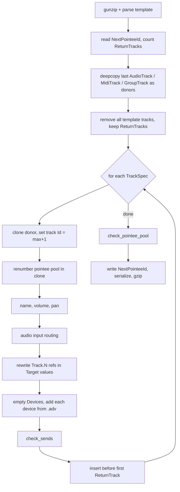

# File renderer

`file_builder/` turns a `RigSpec` into the bytes of a `.als` file with Live closed. `rig_spec.py` is the contract (44 lines); `write_als.py` is the renderer (about 250 lines). Part of the system described in [architecture.md](architecture.md).

## RigSpec and TrackSpec

`file_builder/rig_spec.py`. No device parameters exist in the schema by design.

| Model | Field | Type | Constraints / meaning | Used by renderer |
|---|---|---|---|---|
| `TrackSpec` | `name` | `str` | 1 to 64 chars | yes, both `EffectiveName` and `UserName` |
| | `type` | `"audio"` or `"midi"` | default `"audio"`; picks donor track | yes |
| | `input` | `int \| None` | 1 to 64, 1-based hardware channel | audio tracks only |
| | `output` | `str \| None` | "Only Main supported" | **no**, never read |
| | `devices` | `list[str]` | stock device display names, chain order | yes |
| | `volume_db` | `float` | -70.0 to 6.0, default 0 | yes, converted to gain |
| | `pan` | `float` | -1 to 1, default 0 | yes |
| `RigSpec` | `tracks` | `list[TrackSpec]` | at least 1 | yes |

Because the spec describes the whole session, tracks in the template are scaffolding and are discarded.

## render() pipeline

`render(spec, template_path) -> bytes` creates a `_Renderer`, adds each track, then calls `finish()`. The template file is only read, never written.

Step notes (all in `_Renderer`):

1. `__init__`: parses `LiveSet/Tracks`, records `LiveSet/NextPointeeId` as `next_pointee` and `return_count`. Donors are the **last** track of each kind in the template; `GroupTrack` is collected but `donor()` only serves audio and midi. Raises `LookupError` if the template has no track of the requested type.
2. `add_track`:
   - track `Id` is `max(existing track Ids) + 1` (`next_track_id`; includes return tracks, since they are children of `Tracks`).
   - `renumber(track)` gives every pointee-pool element in the clone a fresh ID.
   - Volume is written to `Mixer/Volume/Manual` as `repr(gain_from_db(db))`; pan to `Mixer/Pan/Manual`.
   - Audio routing: see [Routing](#routing).
   - Devices: the donor's chain is emptied, then `add_device` runs per name.
   - `check_sends`, then insertion before the first `ReturnTrack` (appended if there are none).
3. `finish`: runs `check_pointee_pool`, sets `NextPointeeId` to `next_pointee`, serializes with lxml, applies formatting (below), gzips.

## IDs and the pointee pool

- **Pool membership** is `in_pointee_pool(element)`: has an `Id` attribute and (`tag == "Pointee"` or tag ends with `Target`). This covers `AutomationTarget`, `ModulationTarget`, `Pointee` and the eight specialised `*ModulationTarget` variants without a hand-written list.
- **`renumber(subtree)`** walks the subtree, assigns `next_pointee++` to each pool element, records old-to-new, then rewrites every `PointeeId/@Value` in the subtree that matches an old ID. References to IDs outside the subtree are left alone.
- It is called on each cloned track and on each inserted device (before the device's own `Id` is set).
- **Track IDs** are a separate namespace (`next_track_id`).
- **Device IDs** are context-scoped: `add_device` sets `Id = len(Devices) + 1` before appending, so they restart per track.
- **`check_pointee_pool`** (before serialization): raises `ValueError` on duplicate pool IDs, on any `PointeeId` whose value is not a pool ID, or if `next_pointee <= max(ID)`.

## Device insertion

`device_preset(name)` resolves a display name to an `.adv` under Live's Core Library (hard-coded `LIVE_APP = /Applications/Ableton Live 12 Trial.app`):

1. `Defaults/Audio Effects/<name>.adv` if present (factory default).
2. Else `Devices/Audio Effects/<name>/` must exist, otherwise `LookupError("no stock device named ...")`.
3. Else `PRESET_FALLBACKS[name]` in that folder (currently only `"Compressor": "Sustained Lead Vocal.adv"`).
4. Else the alphabetically first `.adv` in the folder; `LookupError` if none.

`add_device`: gunzip the `.adv`, take its single child other than `OverwriteProtectionNumber` (error if not exactly one), `renumber` it, set `Id`, append to `DeviceChain/DeviceChain/Devices`. `.adv` element names are internal (`Compressor2`, `Eq8`), but lookup is by display/folder name, so the mapping never needs to be written down.

If Live is not installed, `LookupError` propagates; `Server.export` in `app/server.py` converts it into a user-facing sentence. Only audio effects are supported (folder is `Audio Effects`).

## Routing

Audio tracks only; MIDI tracks keep the donor's routing and `input` is ignored.

| `input` | `Target` | `UpperDisplayString` | `LowerDisplayString` |
|---|---|---|---|
| `None` | `AudioIn/None` | `No Input` | `""` |
| `n` | `AudioIn/External/M{n-1}` | `Ext. In` | `str(n)` |

Output is never touched (donor's value, `AudioOut/Main` in the template). After setting input, every `Target` under the track's `DeviceChain` is scanned for `Track.<digits>` (`TRACK_REF`). A reference to the donor's own ID becomes the new track's ID; a reference to a return track (still in the set) is kept; anything else names a track the template no longer has and raises `ValueError` rather than silently routing the track into itself.

## Volume

`gain_from_db(db) = 10 ** (db / 20)`. Live stores a linear gain: 0 dB is `1`, the fader minimum is 10^(-70/20), maximum 10^(6/20). Written with `repr`, so full float precision (Live itself writes 10 significant digits and accepts ours).

## Formatting quirks

In `finish()`:

- Declaration `<?xml version="1.0" encoding="UTF-8"?>\n` is prepended manually (`DECLARATION`).
- lxml's `<Foo/>` becomes `<Foo />` via `body.replace(b"/>", b" />")`, a blind byte replace.
- Trailing newline ensured. Indentation is whatever the parsed template carried (tabs), not regenerated.
- gzip via `gzip.compress` (level and header irrelevant to Live).

These match Ableton's own output out of caution, not proven necessity.

## Invariants and where they are enforced

| # | Invariant (from `CLAUDE.md`) | Enforcement |
|---|---|---|
| 1 | Pointee pool spans 11 tag names | `in_pointee_pool` suffix match; verified by `check_pointee_pool` (duplicates, dangling) |
| 2 | `NextPointeeId` > every pool ID | `next_pointee` increments in `renumber`; checked in `check_pointee_pool`; written in `finish` |
| 3 | One `TrackSendHolder` per return, Ids `0..N-1` | `check_sends` per track; template returns are kept so `return_count` stays valid |
| 4 | Track IDs global, device IDs context-scoped | `next_track_id` (max+1); `add_device` uses `len(Devices)+1` |
| 5 | Routing targets embed track IDs `TRACK_REF.sub(remap, ...)` over `DeviceChain` `Target` values in `add_track`: donor → clone, returns kept, anything else refused |
| 6 | Never synthesize the `<Ableton ...>` header | Not enforced by a check: the template root is parsed and re-serialized, never constructed |
| 7 | `LomId` stays `0` | Nothing touches it; cloned values pass through |

Not checked anywhere: that a cloned track has no stale references outside `DeviceChain` targets, and that the chosen `.adv` was saved by a Live version compatible with the template.

## Templates and fixtures

| File | Purpose |
|---|---|
| `templates/test.als` | Reference set saved by Live 12.4.5; the default template (`TEMPLATE` in `app/server.py`) |
| `templates/test.reference.xml` | Its decompressed XML, for diffing |
| `templates/probe_noinput.als` | Live's own save of a generated set; source of truth for `AudioIn/None` |

Never mutate these. Golden-file tests must not need Ableton installed (note: device insertion does need Live's Core Library).

## Learning new format facts

Live is the source of truth, not training data:

1. Generate a set containing the thing you are unsure of.
2. Open it in Live, change that one thing by hand, save.
3. Diff Live's save against yours; the difference is the answer.
4. Keep the probe in `templates/`.

Known gaps: hardware output routing (only `AudioOut/Main` known), stereo input pairs, which of `EffectiveName`/`UserName` Live reads. Never generate over a set that is currently open in Live; it holds the file in memory and overwrites on save.

## Discrepancies

- `TrackSpec.output` is accepted but ignored by the renderer.
- `CLAUDE.md` lists `PRESET_FALLBACKS` as naming a preset for Compressor; the code additionally falls back to the first alphabetical preset for any other device lacking a default.
- `GroupTrack` is stripped from the template and kept as a donor, but `donor()` cannot request one.
