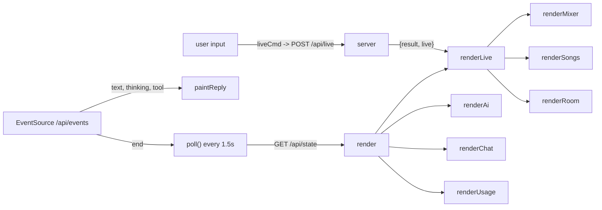

# Frontend

The web page for Holy Sound: a chat pane and a mixer/songs/room pane, served as three static files from `app/static/` (`index.html`, `app.js`, `app.css`). No framework, no bundler, no npm. The JSON API it talks to is in [web-server-api.md](web-server-api.md); the actions it renders as cards are in [assistant-and-actions.md](assistant-and-actions.md).

## Files and serving

| File | Role |
| --- | --- |
| `app/static/index.html` | All markup: header, both panes, bottom nav, three `<dialog>`s, toast container, and a `<template id="strip-template">` cloned per mixer strip. |
| `app/static/app.js` | One classic script (`"use strict"`, no modules), about 1,370 lines. Loaded at the end of `<body>`. |
| `app/static/app.css` | One stylesheet. |

`app/server.py` `_static()` serves them with `Cache-Control: no-cache`. It refuses paths that resolve outside `app/static/`. A reload picks up edits with no build.

## Page layout

```
header.top        brand | #live-status | #transport (play, master meter, BPM)  [hidden until Live connects]
main#layout[data-view]
  section#pane-chat      banner, #messages, composer, "Start a new conversation"
  section#pane-session   tabs (Mixer | Songs | Room), #offline notice, three .tab-panel
nav.bottom-nav           phones only: Chat | Mixer | Songs | Room
dialog#device-dialog     add an effect + preset
dialog#color-dialog      track colour swatches
dialog#import-dialog     folder browser + note, "Import with AI"
#toasts                  aria-live="assertive"
```

- **Desktop:** `.layout` is a two-column grid (`minmax(340px, 5fr) 7fr`), chat left, session right.
- **At 820px and below:** one column. `#layout[data-view]` decides which pane shows. `setView()` writes it from the bottom nav. `data-view="chat"` shows chat. Any other value hides chat, hides the tab bar (the bottom nav replaces it), and calls `setTab(view)`.
- Two selectors for the same thing: desktop tabs are `.tab[data-tab]` and call `setTab`. Phone nav buttons are `[data-view]` and call `setView`.

## app.js structure

Top to bottom, in section-comment order:

| Section | Key symbols |
| --- | --- |
| API | `api(path, body?)`, `liveCmd(cmd, args)` |
| Polling | `poll()`, `render(next)` |
| Header | `setStatus`, `renderLive`, play button, tempo input |
| Chat | `renderChat`, `send`, `bubble`, `thoughts`, `markdownLite`, `proposalCard`, `act`, `exportProposal` |
| Streaming reply | `listen()` (EventSource), `startReply`, `paintReply`, `reply` |
| Assistant activity | `noteActivity`, `paintActivity` |
| Mixer | `renderMixer`, `buildMixerGroups`, `ensureGroup`, `placeStrips`, `createStrip`, `updateStrip`, `slider`, `paintMeter`, `moveTrack` |
| Dialogs | `openDeviceDialog`, `openColorDialog`, `openImportDialog`, `showFolder` |
| Songs | `renderSongs`, `songRow`, `transposer` |
| Room | `renderRoom` |
| Views | `setTab`, `setView` |
| Toasts | `toast(message, kind)` |

### State

Module-level `let`s, no store:

| Variable | Meaning |
| --- | --- |
| `state` | The last `/api/state` payload (or the state returned by a POST). `render()` replaces it wholesale. |
| `sending`, `sendingFrom` | The user message in flight, shown optimistically. `pendingMessage()` drops it once the server's copy appears in `state.chat`, so it never shows twice. |
| `reply` | `{ el, thinking, text, tool }` while an assistant reply is streaming, else `null`. |
| `chatSig`, `songsSig`, `roomSig` | JSON signatures of what was last drawn. Renderers return early when unchanged, which stops polling from wiping scroll, focus or open `<details>`. Set one to `""` to force a redraw. |
| `strips` / `groupEls` | `Map`s of DOM nodes keyed `"t<index>"` / `"r<index>"` and folder key. |
| `holding` | `WeakSet` of range inputs the user is touching. Polling won't overwrite them. |
| `openThoughts` | Ids of chat entries whose "Thinking" is expanded. |
| `currentTab` | `"mixer"`, `"songs"` or `"room"`. |

### Event flow



Everything redraws from state. The page never holds authoritative data, and Live is the source of truth. After a user action the response usually carries fresh state (`/api/live` returns `live`, proposal and chat POSTs return the whole state) and is rendered immediately. Otherwise the next poll catches up.

## API calls

All through `api()`: GET when no body, else JSON POST. Non-2xx responses throw an `Error` with the server's `error` string. Network failure throws "Can't reach Holy Sound. Is it still running on the computer?". Endpoint behaviour is in [web-server-api.md](web-server-api.md).

| Endpoint | When |
| --- | --- |
| `GET /api/state` | `poll()`: on load, then every 1.5 s (600 ms while the song is playing, 5 s when the tab is hidden), on `visibilitychange` back to visible, after SSE `end`, after Apply/Dismiss, after adding a song or exporting. |
| `GET /api/events` (SSE) | Opened once by `listen()`. Events: `start`, `step`, `thinking`, `text`, `tool`, `usage`, `end`. Drives the streaming bubble and the token counter. |
| `POST /api/chat` `{message}` | `send()`: composer submit, Enter, or a suggestion chip. Returns state. |
| `POST /api/import` `{folder, note}` | "Import with AI" in the import dialog. |
| `GET /api/folders?path=` | `showFolder()`: browsing in the import dialog. |
| `POST /api/proposals/<id>/apply` and `/dismiss` `{}` | `act()`: Apply and "Not now" on a card. |
| `GET /api/proposals/<id>/export` | `exportProposal()`: downloads `Holy Sound.als` as a blob. |
| `GET /api/proposals/export-notes?id=` | After a successful download, to append the renderer's notes to the toast. |
| `POST /api/reset` | "Start a new conversation" (after `confirm()`). |
| `POST /api/room` `{add}` or `{remove}` | Room tab: Save and the per-fact delete button. |
| `POST /api/track-folder` `{track, folder}` | `moveTrack()`: drag a strip to a folder, or the strip's Folder select. |
| `POST /api/song-mix` | `songMix()`: the Song mix picker (`pick`) and the Checkpoints dialog (`checkpoint`, `restore`, `delete`). |
| `GET /api/devices` | First open of the add-effect dialog, cached in `stockDevices`. |
| `GET /api/presets?device=` | Each time the effect select changes. Failures are ignored. |
| `POST /api/live` `{cmd, args}` | `liveCmd()`: every direct control. Returns `{result, live}`. |

`cmd` values the page sends through `/api/live`:

| Control | `cmd` |
| --- | --- |
| Play / stop, BPM | `play`, `stop`, `set_tempo` |
| Mute, solo, fader, pan, send | `set_mute`, `set_solo`, `set_volume`, `set_pan`, `set_send` |
| Track name, colour | `set_track_name`, `set_track_color` |
| Output routing (loaded when "More" opens) | `get_routing`, `set_routing` |
| Effects | `load_device`, `delete_device` |
| Songs | `create_scene`, `set_scene` (name or bpm), `fire_scene`, `transpose_song` |
| Clip level | `set_clip_gain` |

The server only accepts commands in `DIRECT_COMMANDS` (`app/server.py`). A new control needs its command added there.

## Chat and Apply flow

1. **Send.** `send()` calls `startSending(text)`, clears the box and renders the message as a dimmed `.pending` bubble. `POST /api/chat` stays open until the whole reply is written. Meanwhile the SSE stream paints the reply live.
2. **Streaming.** `start` creates a `.msg.assistant.streaming` bubble (`startReply`). `thinking` and `text` append to `reply`. `step` starts a new paragraph. `tool` shows a label from `TOOL_LABELS` ("Listening to the stems…", "Writing up the changes…", "Saving that for next week…"). Painting is batched with `requestAnimationFrame`. `end` clears `reply` and polls, and the finished turn then arrives through `/api/state`.
3. **Transcript.** `renderChat()` draws each `state.chat` entry: a bubble (user text, assistant text via `markdownLite`, or a `note` bubble that jumps to the Room tab), a collapsed "Thinking" `<details>`, and a `proposalCard` if the entry has a `proposal`.
4. **Proposal card.** Shows `p.steps` as an ordered list, with tags "removes" (`step.destructive`) and "plays out loud" (`step.audible`). After apply, each step shows `p.results[i].text` with class `ok`, `partial` or `fail`, and the header reads "Applied · N need(s) a look" if any didn't fully work. Status labels come from `STATUS_LABELS`: `pending`, `applied`, `dismissed`, `superseded`, `exported`.
5. **Pending card buttons.**
   - **Apply** is disabled when Live isn't connected (tooltip "Open Live to apply these"). It calls `act(id, "apply")`, which swaps the label to "Applying…" and renders the returned state.
   - **Download session file** appears only when `p.exportable`. It is the primary button when Live is disconnected.
   - **Not now** dismisses.
   - If disconnected, a note explains why and points to the download. Nothing runs without a click.

Composer behaviour: Enter sends and Shift+Enter inserts a newline on a fine pointer. On touch (`(pointer: coarse)`) Enter always inserts a newline. The textarea auto-grows to 180px. Send and import are disabled while `sending !== null || state.busy`.

`markdownLite` supports paragraphs, bullet or numbered lists and `**bold**` only. It HTML-escapes first. Anything that renders model text through `innerHTML` must go through it.

"Import with AI" (paperclip button or the welcome chip) opens the folder browser dialog, then `POST /api/import`, and shows the request as a pending user message.

## Mixer

`renderMixer(snap)` runs from `renderLive()` on every state render, using `state.live.snapshot`.

- **Folders.** The server sends `state.folders` (`{key, label, color}`) in display order. Each track row has `row.folder`. `buildMixerGroups` buckets rows (unknown keys go to `"other"`) and appends a trailing **Shared effects** group for `snap.returns`. Empty folders are kept but hidden until a drag starts (`.groups.dragging`). Collapse state is saved in `localStorage["holysound-collapsed-groups"]` inside try/catch, as a per-device convenience only.
- **Reconciliation, not rebuild.** Strips are cloned from the template once and kept in `strips`. `placeStrips` only moves DOM nodes that are out of order. `updateStrip` writes values into existing inputs. Strips and groups no longer in the snapshot are removed.
- **Moving a track.** Drag the grip (mouse only; hidden on `pointer: coarse`) onto a folder, or use the "Folder" select inside "More" (works on phones). `moveTrack` saves the choice via `/api/track-folder`, then recolours the track in Live with `set_track_color`, because Live can't show folders. "Colour tracks in Live to match these folders" does that for every track.
- **Faders, pan, sends, clip gain.** All use `slider(input, output, command, format)`. It updates the readout and fill locally on `input`, throttles `liveCmd` to about one per 150 ms with a trailing call, and sends a final value on `change`. `holding` keeps the control from being overwritten by polls for 1.2 s after release. Fader range is -70 to +6 dB (0.5 step). Pan is -1 to 1 and displays `C`, `25L` and so on. Clip gain is -24 to +12. Display text comes from the server's `row.volume` / `row.pan` strings, with `-` replaced by a true minus.
- **Mute / solo.** `aria-pressed` toggles. The strip dims when muted.
- **Song mix.** The picker follows `state.song_mix.scene_index` (server state, shared by every viewer), except while its own pick is in flight (`pick._busy`). With a song picked, only that song's tracks show, each with the song's clip level and On/Off, and the faders, pan, mute and sends are that song's: the server saves changes and puts them back when the song is picked, started with Start, or started in Live. "Changes save to …" and a Checkpoints button sit beside the picker; the Checkpoints dialog saves a named copy and lists them with Go back / Delete.
- **Name.** An input committed on `change` (`set_track_name`). The server also renames the track in folder memory. `updateStrip` won't overwrite a name that has focus.
- **"More".** A `<details>` holding effect chips (with a confirm before removal), clip chips per song, sends, per-song clip gain, the folder select, and output routing. Routing is fetched lazily with `get_routing` on first open and again after the type changes.
- **Meters.** There is no separate meter request. `row.meter.peak` (0 to 1, peak since last poll) arrives in each snapshot. `paintMeter` sets the bar height and classes `warm` (≥ 0.8) and `hot` (≥ 0.95), and hides the meter when the reading is null. The master meter in the header uses the same function. Polling speeds up to 600 ms while `song.is_playing`.
- **Assistant activity.** `state.activity` is a list of `{track, ms}`. `noteActivity` stores an expiry per lower-cased track name, and `paintActivity` toggles `.ai-active` (a travelling light) on matching strips and schedules its own expiry.

### Songs tab and transpose

`renderSongs` redraws only when `JSON.stringify(snap.scenes)` changes and no input in the list has focus. Each row has a title, a BPM input (`set_scene`), a transpose control and a Start button (`fire_scene`). "Add song" calls `create_scene`.

`transposer(scene)`:

- **Old RigLink:** if the scene object has no `transpose` key, the control is `hidden`. An older RigLink doesn't report keys, and Live must be restarted to load new RigLink code (see [riglink.md](riglink.md)).
- **Values:** `scene.transpose` is an integer from -12 to 12, or `null` when clips in the song disagree, shown as "Mixed". 0 shows "Original". The value button resets to 0. Minus and plus step by one semitone and disable at ±12. A non-zero key adds `.shifted` for highlighting.
- **Quick presses:** `set(n)` updates the local `key` and redraws first, then sends `transpose_song {scene_index, semitones: n}` as an absolute value. A fast second press therefore counts from the new key and not from the stale poll value. On error, or if the result reports `!r.clips` (no audio clips, with a toast), it rolls back to the previous key.
- **Redraw caveat:** the closure's `key` lives until the next time `renderSongs` rebuilds the row, which happens when `snap.scenes` changes.

## Live-closed and error states

| Condition | What shows |
| --- | --- |
| Poll fails (server down) | Header status goes `bad` with the error text. The last render stays on screen. |
| `live.connected` false | Status "Live not connected". Transport hidden. Mixer and Songs panels hidden, `#offline` card shown (three steps to enable RigLink, plus "You can still chat and plan"). The Room tab still works and hides the card. `live.message` is shown unless it's the standard Control Surface message, which repeats the steps. |
| Live disconnected, proposal pending | Apply disabled. Download button promoted if `exportable`. |
| `state.ai.ready` false | `#ai-banner` in the chat pane shows `ai.message`. |
| `state.demo` | Status reads "Demo set, not Ableton" (the fake Live in `app/fake_live.py`). |
| Any failed `liveCmd` / action | `toast(message, "error")` for 8 s (5 s for info). `liveCmd` toasts then rethrows, so call sites use `.catch(() => {})` to avoid double reporting. |
| Failed send | The message returns to the input if it's empty, and a toast shows. |

Error strings come from the server as full sentences, matching the project rule of no JSON or jargon for the volunteer.

## CSS (`app/static/app.css`)

- **Tokens on `:root`:** `--bg`, `--panel`, `--panel-2`, `--line`, `--text`, `--muted`, `--accent` (amber), `--accent-ink`, `--accent-soft`, `--ok`, `--warn`, `--danger`, `--danger-soft`, `--user`, `--shadow`, `--radius`, `--font`. Dark is the default ("this usually runs at a sound desk in a dim room"). Component-local tokens are set on the component: `--track-color` and `--fader-h` on `.strip`, `--swatch` on dots and swatches, `--fill` on range inputs, `--tabs-h` on `<html>` (set by `syncTabsOffset()` so sticky folder headers sit under the tab bar).
- **Themes:** `@media (prefers-color-scheme: light)` overrides the tokens under `:root:not([data-theme="dark"])`. Setting `data-theme="dark"` on `<html>` forces dark. Nothing in `app.js` sets it, and there is no light-force counterpart.
- **Sections** (by comment banner): header, layout, chat, session, dialog and toasts, meters/clips/colours, room memory.
- **Responsive:** breakpoints at 820px (single column plus bottom nav, hidden header detail, toasts lifted above the nav) and 480px (tighter strips, hidden fact dates). Uses `env(safe-area-inset-bottom)` and `viewport-fit=cover`. `@media (pointer: coarse)` hides the drag grip and enlarges transpose buttons (40px minimum).
- `[hidden] { display: none !important; }` is global, so setting `el.hidden` always works whatever the component's `display` rule is.
- `.strip` uses `@property`-style orbit animation for the `ai-active` light, which is wrapped by `prefers-reduced-motion`.

## Accessibility notes

- Live status is `role="status" aria-live="polite"`. Toasts are `aria-live="assertive"`. Note bubbles carry `role="status"`.
- Icon-only buttons have `aria-label`s (play/stop flips between "Play" and "Stop", colour button per track, remove effect, forget fact, transpose with the track name).
- Mute and solo use `aria-pressed`. Tabs use `role="tab"` with `aria-selected`. The bottom nav uses `aria-current="page"`. Folder toggles use `aria-expanded`.
- Range inputs have `aria-label`s (Level, Pan, Send A, Clip level in <song>). The visible `<output>` shows the value.
- `:focus-visible` has a global accent outline. Dialogs are native `<dialog>` with `showModal()` for focus trapping and Esc.
- Gaps worth knowing: the tab bar has `role="tablist"` and `role="tab"` but no `role="tabpanel"` or arrow-key handling. The drag-to-folder grip is `aria-hidden`, and the "Folder" select is the keyboard path. Meters are `aria-hidden`.

## Conventions for contributors

- No framework, no build, no new dependencies. Keep it plain DOM, one script, served as-is. Don't add a module system or minifier without discussing it.
- **Render from state, idempotently.** Add new UI as a renderer called from `renderLive` or `render`. Compare a signature (`JSON.stringify(...)`) before touching the DOM, and don't clobber focused inputs (`document.activeElement`) or controls in `holding`.
- Direct controls go through `liveCmd`, which toasts failures. Don't call `fetch` directly except for binary downloads (`exportProposal`).
- Use `textContent` for anything user- or model-supplied. If you need `innerHTML` for model text, use `markdownLite`.
- Per-device preferences only in `localStorage`, wrapped in try/catch. Session state belongs on the server.
- Copy is for a volunteer, not an engineer: full sentences, no JSON, no jargon. Use the existing tokens, not hard-coded colours, and make both themes work.
- Test by running the app (`uv run python -m app`) against the fake Live, or see [testing-and-development.md](testing-and-development.md). There are no JS tests.

## Discrepancies

- `CLAUDE.md` describes `app/static/` as "HTML/CSS/JS, served as-is", which matches. It doesn't mention the SSE endpoint `/api/events`, which the page opens for streaming replies. See [web-server-api.md](web-server-api.md).
- The meter is described in the code comment as "peak since the last poll", but the page does nothing to compute that. It displays whatever `meter.peak` the server sends. Whether it is a true since-last-poll peak is determined by RigLink/`app/live.py`, not verified here. See [riglink.md](riglink.md).
- No JS test coverage was found for `app.js`.

See also: [architecture.md](architecture.md), [cli-and-live-control.md](cli-and-live-control.md), [audio-analysis-and-memory.md](audio-analysis-and-memory.md).
