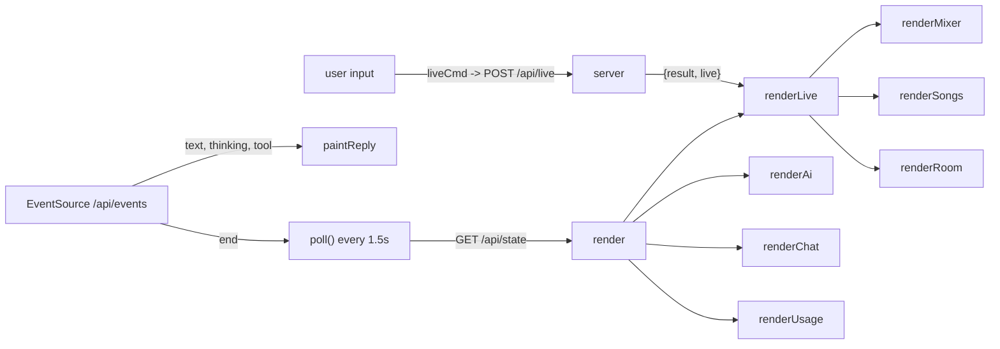

# Frontend

The web page for Holy Sound: a chat log on the left and the set (Mixer, Songs, Room) on the right, served as static files from `app/static/`. No framework, no bundler, no npm. The JSON API it talks to is in [web-server-api.md](web-server-api.md); the actions it shows as change slips are in [assistant-and-actions.md](assistant-and-actions.md). The volunteer's view of these screens is [weekly-workflow.md](weekly-workflow.md).

## Files and serving

| File | Role |
| --- | --- |
| `app/static/index.html` | All markup: header, both panes, bottom nav, five `<dialog>`s, toast container, a screen-reader status region, and a `<template id="strip-template">` cloned per channel strip. |
| `app/static/app.js` | One classic script (`"use strict"`, no modules), about 2,260 lines. Loaded at the end of `<body>`. |
| `app/static/app.css` | One stylesheet. |
| `app/static/fonts/` | Self-hosted `woff2` fonts (Big Shoulders Display 700/800, Source Sans 3 400/600/700) and their licences, so the page works on church Wi-Fi with no internet. |

`app/server.py` `_static()` serves them. Pages, script and stylesheet get `Cache-Control: no-cache`, so a reload picks up edits with no build. Fonts get `font/woff2` and a one-day cache. Paths that resolve outside `app/static/` are refused.

## Design language

The stylesheet's header comment sets the rules, and new UI should follow them:

- **Paper** means a person has to act or decide: the change slip waiting for Apply, and lit keys.
- **Tape** is identity: the coloured name plate (scribble strip) at the foot of each channel, in the track's own colour.
- **A lamp** is status: green is fine, amber is careful, red is hot or failed, blue is solo.
- **Dark only.** It is used at a sound desk in a dim room. There is no light theme. Depth comes from tone, never shadow.
- **Motion means someone else changed it.** A value Live or the assistant set glides there, new things slide in, things that change place travel. What the volunteer is holding follows their hand with no delay. The light that runs round a channel still marks the assistant editing it.

Wording follows the same idea: "Ableton", not "Live", in anything the volunteer reads; levels as percentages ("68%", "Off"); balance as "Centre" or "25% left".

## Page layout

```
header.top        mark + "Holy Sound" | #live-status | #transport (Play, BPM, Main meter)  [transport hidden until Ableton connects]
main#layout[data-view]
  section#pane-chat      "Start over", #ai-banner, #messages (welcome, log), #slip-dock, composer
  section#pane-session   tabs (Mixer | Songs | Room), #offline card, three .tab-panel
    #panel-mixer           song-mix bar (Song mix, "Changes save to …", Checkpoints), #groups (the bank), #drawer
    #panel-songs           cue list, Add song
    #panel-room            facts ledger, Save
nav.bottom-nav           phones only: Chat | Mixer | Songs | Room
dialog#device-dialog     add an effect + preset
dialog#color-dialog      track colour swatches
dialog#checkpoint-dialog song mix checkpoints
dialog#import-dialog     folder browser + note, "Import song files"
dialog#confirm-dialog    the app's own yes/no (replaces window.confirm)
#toasts                  aria-live="assertive"
#sr-status               polite live region for say()
```

- **Desktop:** `.layout` is a two-column grid: chat fixed at 360px (up to 440px on screens 1600px and wider), the set takes the rest.
- **At 820px wide or 500px tall and below:** one column. `#layout[data-view]` decides which pane shows. `setView()` writes it from the bottom nav. `data-view="chat"` shows chat. Any other value hides chat and the tab bar (the bottom nav replaces it) and calls `setTab(view)`.
- Desktop tabs are `.tab[data-tab]` and call `setTab`. Phone nav buttons are `[data-view]` and call `setView`. The phone's Chat button shows a numbered badge (`#nav-chat-mark`) while a change slip is waiting, and the Mixer button shows a small chase (`#nav-chase`) while the assistant is editing a channel.

## app.js structure

Top to bottom, in section-comment order:

| Section | Key symbols |
| --- | --- |
| Small helpers | `el`, `button`, `escapeHtml`, `trueMinus`, `nextSundayLabel`, `shortDate`, `say` |
| API | `api(path, body?)`, `liveCmd(cmd, args)` |
| Polling | `poll()`, `render(next)` |
| Header | `setStatus`, `renderLive`, `setCount`, Play button, tempo input |
| Chat (a log) | `renderAi`, `renderUsage`, `pendingMessage`, `turn`, `eventLine`, `working`, `dockedProposal`, `renderChat`, `paintWelcome`, `thoughts` |
| Reply being written | `startReply`, `paintReply`, `listen()` (EventSource), `markdownLite` |
| Change slip | `consequence`, `stepRow`, `slipEl`, `act`, `exportProposal`, `send`, `ask` |
| Fader law | `LAW`, `dbToPos`, `posToDb`, `percent`, `sendText`, `dbText`, `panText`, `panFromText` |
| Assistant at work | `noteActivity`, `startRun`, `stopRun`, `paintActivity` |
| Mixer | `renderMixer`, `renderMixSong`, `songClip`, `songMix`, `renderCheckpoints`, `buildMixerGroups`, `ensureGroup`, `moveTrack`, `matchColours`, `placeStrips` |
| Selection and drawer | `keepSelection`, `selectStrip` |
| Channel strip | `buildMore`, `createStrip`, `wireFader`, `setFaderPosition`, `slider`, `describeRouting`, `paintNote`, `updateStrip`, `updateSongMix`, `paintMeter`, `updateClips`, `deviceRow`, `sendControl`, `loadRouting` |
| Tone (EQ) | `buildTone`, `updateTone`, `paintTone`, `setBand`, `eqFlat`, `buildHandles`, `wireHandle`, `eqKind`, `bandDb`, `curvePath` |
| Dialogs | `openDeviceDialog`, `loadPresets`, `DEVICE_HELP`, `openColorDialog`, `openImportDialog`, `showFolder` |
| Songs (a cue list) | `renderSongs`, `songRow`, `transposer` |
| Room (a ledger) | `renderRoom` |
| Views | `setTab`, `setView` |
| Toasts | `toast(message, kind)` |

### State

Module-level `let`s and `const` collections, no store:

| Variable | Meaning |
| --- | --- |
| `state` | The last `/api/state` payload (or the state returned by a POST). `render()` replaces it wholesale. |
| `sending`, `sendingFrom` | The user message in flight, shown optimistically. `pendingMessage()` drops it once the server's copy appears in `state.chat`, so it never shows twice. |
| `reply` | `{ el, thinking, text, tool }` while an assistant reply is streaming, else `null`. |
| `applyingId` | The proposal whose Apply was just pressed, so its slip goes dark at once, before the server reports progress. |
| `exportNotes` | Proposal id to the list of things a saved Ableton file could not include. |
| `chatSig`, `songsSig`, `roomSig` | JSON signatures of what was last drawn. Renderers return early when unchanged, which stops polling from wiping scroll, focus or open `<details>`. Set one to `""` to force a redraw. |
| `strips` / `groupEls` | `Map`s of DOM nodes keyed `"t<index>"` / `"r<index>"` and folder key (`"returns"` for shared effects). |
| `selectedKey` | The channel shown in the drawer, or `null`. |
| `mixSong` | Scene index picked in **Song mix**, or `null` for every track. Follows `state.song_mix.scene_index` from the server. |
| `holding` | `WeakSet` of range inputs the user is touching. Polling won't overwrite them. |
| `litUntil` | Lower-cased track name to the time its assistant light should go out. |
| `openThoughts` | Ids of chat entries whose "Show how I worked it out" is expanded. |
| `currentTab` | `"mixer"`, `"songs"` or `"room"`. |

### Event flow



Everything redraws from state. The page never holds authoritative data, and Ableton is the source of truth. After a user action the response usually carries fresh state (`/api/live` returns `live`; proposal, chat, song-mix and room POSTs return the whole state) and is rendered at once. Otherwise the next poll catches up.

## API calls

All through `api()`: GET when no body, else JSON POST. Non-2xx responses throw an `Error` with the server's `error` string. Network failure throws "Can't reach Holy Sound. Is it still running on the computer?". Endpoint behaviour is in [web-server-api.md](web-server-api.md).

| Endpoint | When |
| --- | --- |
| `GET /api/state` | `poll()`: on load, then every 1.5 s (600 ms while a song plays, 250 ms while changes are being applied, 5 s when the tab is hidden), on `visibilitychange` back to visible, after SSE `end`, after Apply/Not now, after adding a song, starting a song or saving a file. |
| `GET /api/events` (SSE) | Opened once by `listen()`. Events: `start`, `step`, `thinking`, `text`, `tool`, `usage`, `end`. Drives the reply being written and the token count. |
| `POST /api/chat` `{message}` | `send()`: composer submit, Enter, or a welcome starter. Returns state. |
| `POST /api/import` `{folder, note}` | "Import song files" in the import dialog. |
| `GET /api/folders?path=` | `showFolder()`: browsing in the import dialog. |
| `POST /api/proposals/<id>/apply` and `/dismiss` `{}` | `act()`: Apply and "Not now" on a change slip. |
| `GET /api/proposals/<id>/export` | `exportProposal()`: downloads `Holy Sound.als` as a blob. |
| `GET /api/proposals/export-notes?id=` | After a successful download, for the "Not in the file" line under the slip. |
| `POST /api/reset` | "Start over" (after the app's own confirm dialog). |
| `POST /api/room` `{add}` or `{remove}` | Room tab: Save and Forget. |
| `POST /api/track-folder` `{track, folder}` | `moveTrack()`: drag a name plate to a folder, or the drawer's Folder select. |
| `POST /api/track-key` `{track, follows}` | The drawer's **Changes with the song key** checkbox. Returns state. |
| `POST /api/eq-flat` `{track}` | The drawer's **Flat** button (`eqFlat`). Returns state. |
| `POST /api/song-mix` | `songMix()`: the Song mix picker (`pick`) and the Checkpoints dialog (`checkpoint`, `restore`, `delete`). Returns state. |
| `GET /api/devices` | First open of the add-effect dialog, cached in `stockDevices`. |
| `GET /api/presets?device=` | Each time the effect select changes. Failures are ignored. |
| `POST /api/live` `{cmd, args}` | `liveCmd()`: every direct control. Returns `{result, live}`. `get_routing` goes through `api()` directly. |

`cmd` values the page sends through `/api/live`:

| Control | `cmd` |
| --- | --- |
| Play / stop, BPM | `play`, `stop`, `set_tempo` |
| Mute, solo, fader, balance, send | `set_mute`, `set_solo`, `set_volume`, `set_pan`, `set_send` |
| Track name, colour (also folder moves and "Copy folder colours") | `set_track_name`, `set_track_color` |
| Output routing (loaded when a channel is shown in the drawer) | `get_routing`, `set_routing` |
| Effects | `load_device`, `delete_device` |
| Tone (EQ): drag, keys, type, On, Add EQ | `set_eq_band`, `load_device` (EQ Eight) |
| Songs | `create_scene`, `set_scene` (name or bpm), `fire_scene`, `transpose_song` |
| Level in a song, Playing / Left out | `set_clip_gain`, `set_mute` (plus `set_clip_active` on to bring back a clip switched off in Live) |

The server only accepts commands in `DIRECT_COMMANDS` (`app/server.py`). A new control needs its command added there. For `transpose_song` the server adds the tracks that keep their key itself.

## Chat: a log, not a messenger

1. **Welcome.** With an empty chat, `#welcome` shows the date of the coming Sunday ("Sunday 11 Oct", or "Today"), one line about the set ("Your set has 12 channels. Tell me what is different this Sunday." or "Nothing is set up yet…"), four starters (three sentences that are sent as messages, and "Import song files from a folder", which opens the import dialog), and the two newest Room facts with an **Open Room** button.
2. **Send.** `send()` calls `startSending(text)`, clears the box and shows the message as a dimmed `.pending` turn. `POST /api/chat` stays open until the whole reply is written. Meanwhile the SSE stream paints the reply live.
3. **Streaming.** `start` makes a `.turn.assistant.streaming` entry (`startReply`). `thinking` and `text` append to `reply`. `step` starts a new paragraph. `tool` shows a label from `TOOL_LABELS` ("Listening to the song files…", "Writing up the changes…", "Saving that for next week…"). Painting is batched with `requestAnimationFrame`. The thinking summary reads "Working it out…" until text arrives, and follows new lines unless the volunteer scrolled up in it. `end` clears `reply` and polls; the finished turn arrives through `/api/state`.
4. **The log.** `renderChat()` draws each `state.chat` entry as a turn headed "You" or "Holy Sound" (assistant text through `markdownLite`), with a collapsed "Show how I worked it out" `<details>` when there was thinking. `note` and `heard` entries are one-line events labelled "Saved" and "Heard"; a "Saved" line opens the Room tab. Proposals that are settled show in the log as collapsed slips.
5. **Start over** sits above the log once there is a conversation. Its tooltip shows the token count. It asks "Start over?" ("The chat is cleared. Your Ableton set stays as it is.") before `POST /api/reset`.

Composer: Enter sends and Shift+Enter inserts a newline on a fine pointer. On touch (`(pointer: coarse)`) Enter always inserts a newline. The textarea grows to 180px. Send and "Import song files from a folder" are disabled while `sending !== null || state.busy`.

`markdownLite` supports paragraphs, bullet or numbered lists (both drawn as bullets) and `**bold**` only. It HTML-escapes first. Anything that renders model text through `innerHTML` must go through it.

### The change slip

A proposal that still needs a decision, or is being applied, is docked in `#slip-dock` above the composer (`dockedProposal()`). Everything else sits in the log.

- **Waiting (paper).** Headline "3 changes, not applied yet", then the numbered steps. Steps that remove something carry a red note ("Removes this track from your set.", "Removes this song…", "Removes this effect…"); steps that make sound carry "You will hear this in the room." Buttons: **Apply 3 changes** and **Not now**. When docked, screen readers hear "Holy Sound suggests 3 changes. Press Apply or Not now."
- **Ableton closed.** Apply is replaced by a disabled line "Apply (Ableton isn't open)" and a note. If the proposal is `exportable`, **Save as an Ableton file** is the main button. After a save, the slip collapses to "Saved as an Ableton file" and lists anything "Not in the file".
- **Applying (dark).** Pressing Apply sets `applyingId` and the slip goes dark at once with "Applying 3 changes" and an amber lamp. Each step shows Waiting, Working, Done, Check or Failed from `state.applying.states[i]` (the server's live progress), and the list keeps the working step in view. Polling runs every 250 ms meanwhile.
- **Finished.** Headline "3 changes applied" (green), "2 applied, 1 needs a look" (amber) or "Nothing was applied" (red). A failed step shows the server's reason; a partial one shows the "But …" part of it. Long finished lists in the log show four steps and **Show all**. Keyboard focus moves to the headline and it is read out.
- **Collapsed.** Dismissed ("3 changes, not applied"), superseded ("Replaced by a newer list") and exported slips are one line with **Show steps**.

Nothing runs without a click.

### Import

"Import song files from a folder" (under the composer, or the welcome starter) opens the import dialog: shortcut roots, **Up one folder**, a folder list with audio counts, a preview of the audio files in the current folder, and an optional note ("Anything I should know?"). **Import song files** (which reads "Listening to your files…" while it runs) closes the dialog, shows "Import the song files in "<folder>"." as a pending user turn, and calls `POST /api/import`.

## Mixer: a bank of channels in folders

`renderMixer(snap)` runs from `renderLive()` on every state render, using `state.live.snapshot`.

### Folders (buses)

The server sends `state.folders` (`{key, label, color}`) in display order: Vocals, Instruments, Click & playback, Other. Each track row has `row.folder`. `buildMixerGroups` buckets rows (unknown keys go to `"other"`) and appends a trailing **Shared effects** folder for `snap.returns`. Each folder is a `.track-group` with a **bus** button (name, count, fold mark) and a bracket over its strips. Pressing the bus folds the folder to a narrow vertical label; fold state is saved in `localStorage["holysound-collapsed-groups"]` inside try/catch, as a per-device convenience only. Empty folders are kept but hidden until a drag starts, with a "Drop here" slot.

Strips are reconciled, not rebuilt: each is cloned from the template once and kept in `strips`. `placeStrips` only moves DOM nodes that are out of order, and `updateStrip` writes values into existing controls. Strips and folders no longer in the snapshot are removed.

**Moving a track.** Drag its name plate onto a folder (computers), or use the **Folder** select in the drawer (phones and keyboards; it commits 700 ms after the last change, on blur or on Enter). `moveTrack` saves the choice via `/api/track-folder`, then recolours the track in Ableton with `set_track_color`, because Ableton can't show folders. **Copy folder colours to Ableton** in the drawer does that for every track.

### A channel strip

Top to bottom, from `#strip-template`:

- **Balance bar** (`.pan`): a thin bar with a dot over a native range input (-1 to 1). Double-click centres it.
- **Mute** and **Solo** buttons (`aria-pressed`). Mute reads "Muted" when on and the strip dims; Solo lights the strip.
- **Fader zone:** a scale, a slot, a drawn cap and an invisible native range input (0 to 1000) on top, so the keyboard, touch and screen readers get a real slider while the eye gets a console. A segment meter sits beside it. A ghost tick briefly marks where the level was after the assistant moves it.
- **Note** under the fader: "Editing…" while the assistant works on it, "Changed" for four seconds after, "Solo", "Left out" (muted in the picked song, or its clip switched off there), or otherwise where the sound comes from or goes ("Input 1", "Playback", "MIDI", "Out 3/4", "Effects only", "Shared").
- **Name plate** (scribble strip): the track name on the track's colour. It is the select button and the drag handle. Shared effects drop Ableton's "A-" prefix here.

**Fader law.** One table, `LAW`, maps dB to cap position: -70 dB at 0, -40 at 0.16, -30 at 0.28, -20 at 0.42, -10 at 0.6, 0 dB at 0.8, +6 at the top. The cap, the scale and the 0 dB line all use it. The page only uses it for position and display; `set_volume` and `set_send` still send dB. A hand drag snaps to 0 dB within ±1 dB (with a 5 ms vibrate on phones); arrow keys move 1% and Page Up/Down 5% with no snap; double-click goes to 0 dB. Levels read as percentages of travel (`percent(db)`, "68 percent" for screen readers, "Off" at the bottom). Sends use the same table and read "68%" or "Off".

On a touch screen (`pointer: coarse`) the native input is switched off so the strip can scroll sideways, and the cap's hit area (`.cap-hit`) is the handle, moved by vertical drag.

Fader, balance, sends and clip levels all throttle `liveCmd` to about one call per 150 ms with a trailing call, send a final value on `change`, and stay in `holding` for 1.2 s after release so a poll can't pull them back.

**Meters.** They have their own feed. `pollMeters()` reads `GET /api/meters` again `METER_GAP_MS` (30 ms) after each reply, so it runs as fast as RigLink's ~100 ms tick allows; it stops while the tab is hidden and slows to 1.5 s while Live is unreachable. `aimMeter` sets each meter's target; `drawMeters` runs every animation frame, jumps straight up to a new peak and falls at `METER_FALL_PER_S` (1.6 meter-heights a second), writing `--lit`. The CSS has no transition on meters, so nothing lags behind that. The snapshot's `row.meter` still decides whether a channel has a meter (`paintMeter` hides it when null) and supplies the level only when the feed hasn't answered for a second (an older RigLink without `get_live_meters`). The header's **Main** meter works the same way.

**Motion.** The "motion" block near the top of `app.js` has four tools, all no-ops under reduced motion: `tween(owner, key, from, to, apply)` (eased number over 420 ms, one per owner and key, restarted from wherever it is), `glideInput(input, to, onFrame)` (a range input set from a poll), `enter(node)` / `leave(node)` (slide in, fade out) and `flip(container, selector, key, change)` (keyed FLIP: rebuilt rows still travel from their old place). Used for: the fader cap (CSS `transition: bottom`, off while `.is-down`), pan, balance, sends, song and clip levels, tempo, the EQ curve and dots (frequency on a log scale), new or removed strips and their neighbours, folder folding, songs reordered or added, room facts, effects added, the drawer and tab panels, chat entries (each once, by entry id, never on first load), the docked slip and its steps, step lamps (pulse while working, land when they change), toasts and dialogs. Slider drags and EQ drags stop any glide on that control (`stopTween`).

**Assistant activity.** `state.activity` is a list of `{track, ms}`. `noteActivity` stores an expiry per lower-cased track name; `paintActivity` starts a light that runs round the matching strip's edge (an SVG with three dashes), for at least one whole lap. While it runs the strip holds its old level, then the cap glides to the new one and a ghost tick shows where it was. Screen readers hear "Editing Lead Vocal" and "Changed Lead Vocal". With reduced motion the light becomes a still outline.

### The drawer

Below the bank, `#drawer` shows one channel. With nothing selected it reads "Tap a channel to rename it, add an effect or change where it plays." Tapping a name plate (or the strip's own padding) selects it; on phones the pane scrolls so the drawer's first section shows while the channel's fader and Mute stay on screen. Each strip owns its drawer content (`strip._more`, built by `buildMore`), and `keepSelection` swaps it in.

Five sections:

| Section | Contents |
| --- | --- |
| **Channel** (or "Channel 3", "Shared effect A") | Name field (committed on change or Enter, `set_track_name`; the server also renames it in folder memory), a routing summary sentence from `describeRouting` ("Input 1. Plays through the main speakers."), and a **Colour** button that opens the swatch dialog. |
| **Sound** | Mute and Solo (the same state as the strip's buttons), "Mute silences it. Solo plays only this channel.", and **Balance** with its value in words. With a song picked in Song mix and this track playing in it: **In <song>**, a switch reading **Playing in this song** or **Left out of this song** (that song's mute, so it takes effect at once while the song plays), and that song's **Level** (-24 to +12 dB, `set_clip_gain`). |
| **Reverb and delay** (titled after the return tracks, e.g. "Reverb and Delay") then **Other effects** | One send slider per return track, in percent. Then the track's effects, numbered, each with a remove button that asks first ("Remove Reverb?" … "Undo in Ableton brings it back."), and **Add effect**. |
| **Where it plays** | **Folder** select, **Copy folder colours to Ableton**, **Plays to** (output type: "The room (main speakers)", "Another output (in-ears, etc.)", "Only the shared effects", plus a channel select when there is a choice), **Changes with the song key** checkbox, and **Level in each song** with one slider per song the track has a clip in. |
| **Tone (EQ)** | The track's first EQ Eight (`row.eq`), full drawer width. See below. |

For shared effects, Balance, sends, folder and Copy colours are hidden and the effects heading reads "Effects". The key checkbox is hidden for shared effects and MIDI tracks and is checked when `!row.keeps_key`. Output routing is fetched with `get_routing` when the channel is shown in the drawer and again when its output changes.

### Tone (EQ)

An SVG graph, 20 Hz to 20 kHz on a log x axis and ±15 dB on y, with the summed curve of every band that's on and one numbered handle per band. The curve is display only: `bandDb` evaluates textbook (RBJ) biquads at 48 kHz (steep cuts drawn as four times a 12 dB one), not EQ Eight's own filters.

- **Drag** a handle: left-right sets frequency, up-down sets gain (in 0.5 dB steps; only for bell and shelves). Dragging a band that's off turns it on. **Arrow keys** move a focused handle a semitone (Shift: four) or 0.5 dB (Shift: 2 dB). **Double-click** resets gain to 0.
- Below the graph, the selected band: its **type** select (Live's own type names, labelled in plain words via `eqKind`), an **On** checkbox, and a readout ("1.20 kHz · -3.0 dB · Q 0.71"). **Flat** posts `/api/eq-flat`.
- `setBand` updates the screen at once and sends `set_eq_band`, throttled to one call per 120 ms while dragging; polls don't redraw the graph during a drag or for 1.5 s after a change, so it doesn't jump back. `updateTone` redraws only when the EQ's JSON signature changes.
- A track with no EQ Eight shows "No EQ on this channel yet." and **Add EQ** (`load_device` EQ Eight). With a song picked, the help line says the curve is saved with that song.

### Song mix

The bar above the bank holds **Song mix** (a select listing "Every track" and every named song as "1. Way Maker"), **Changes save to <song>** and **Checkpoints** (with a count once there are some). The picker follows `state.song_mix.scene_index`, which is server state shared by every viewer, except while its own pick is in flight (`pick._busy`). A poll that started before the last pick keeps the page's `song_mix` (`mixPickedAt`).

With a song picked:

- `buildMixerGroups` keeps only tracks with an audio clip in that song (`songClip(row)`); shared effects stay.
- The faders, balance, mute, sends and EQ are that song's. The server saves changes as they happen and puts them back when the song is picked, started with **Start**, or started in Ableton (see `app/song_mixes.py`). Solo and the main fader are not kept per song.
- Each channel's drawer gets **In <song>**: Playing / Left out and the song's Level. Playing / Left out is the track's mute, saved with the song's mix; Level is clip gain, which Ableton applies when the song starts, with or without the page open.
- A strip muted in the picked song, or whose clip is switched off there, greys out (`.song-off`) and its note reads "Left out". Bringing it back unmutes it and turns a switched-off clip back on.

**Checkpoints** opens a dialog: "Changes save to this song as you make them. A checkpoint keeps this exact mix so you can come back to it." A name field and **Save checkpoint**, then the list, each with when it was made, **Go back to this** and **Delete**. Going back first saves the mix it replaces as a checkpoint, and the toast says so.

## Songs: a cue list

`renderSongs` redraws only when `snap.scenes` or the set of playing songs changes and no input in the list has focus. Each row: the song number, an editable title ("Name this song", `set_scene`), a BPM field (`set_scene`), the key control, and **Start** (`fire_scene`), which reads "Playing" on the song whose clips are playing. Starting a song here also puts the mixer on its mix. **Add song** (title and optional BPM) calls `create_scene`.

`transposer(scene)`:

- **Old RigLink:** if the scene has no `transpose` key, the control is hidden. An older RigLink doesn't report keys, and Ableton must be restarted to load new RigLink code (see [riglink.md](riglink.md)).
- **Values:** `scene.transpose` is -12 to 12, or `null` when clips in the song disagree. The middle key reads "Original key", "Up 2 half steps", "Down 1 half step" or "Mixed keys", and pressing it goes back to the original key. − and + step one semitone and disable at ±12. A song off its original key is lit (`.shifted`) so nobody forgets it on Sunday.
- **Quick presses:** `set(n)` updates the local `key` and redraws first, then sends `transpose_song {scene_index, semitones: n}` as an absolute value, so a fast second press counts from the new key. On error, or if the result has no clips ("That song has no audio clips to transpose."), it rolls back.
- The server transposes every audio clip in the song except tracks that keep their key (click, guide, cue, count, SMPTE, timecode, metronome by name, or per the drawer's checkbox), and the song keeps its tempo.

## Room: a ledger

"Your room" lists what Holy Sound remembers, each fact with the date it was added and **Forget**. "Add something to remember" and **Save** add one (`/api/room`). A duplicate gets "That is already saved."; a full Room (60 notes) says to forget one first. The Room tab works with Ableton closed.

## Ableton-closed and error states

| Condition | What shows |
| --- | --- |
| Poll fails (server down) | Header status goes `bad` with the error text. The last render stays on screen. |
| `live.connected` false | Status "Ableton isn't connected". Transport hidden. Mixer and Songs panels hidden; the `#offline` card shows three steps (open Ableton; Settings, then **Link, Tempo & MIDI**; pick **RigLink** under Control Surface) and "You can still chat and plan. New tracks can be saved as an Ableton file." `live.message` shows above the steps unless it is the standard Control Surface message. The Room tab still works and hides the card. |
| Ableton closed, proposal pending | Apply off, **Save as an Ableton file** promoted if `exportable`. |
| `state.ai.ready` false | `#ai-banner` in the chat pane shows `ai.message`. |
| `state.demo` | Status reads "Demo set, not Ableton" (the fake Live in `app/fake_live.py`), and the offline card never shows. |
| Any failed `liveCmd` / action | `toast(message, "error")` for 8 s (4 s for info; hovering holds it). `liveCmd` toasts then rethrows, so call sites use `.catch(() => {})` to avoid double reporting. |
| Failed send | The message returns to the box if it's empty, and a toast shows. |

Error strings come from the server as full sentences, matching the project rule of no JSON or jargon for the volunteer.

## CSS (`app/static/app.css`)

- **Tokens on `:root`**, grouped: ground greys (`--enamel` page, `--recess` slots and inputs, `--face` strips, drawer and dialogs, `--key`, `--key-line`, `--hair`, `--edge`), text (`--text`, `--text-2`, `--legend`), one accent (`--accent` green, `--accent-ink`, `--accent-edge`) plus `--lit-bg`/`--lit-ink` for lit keys, paper (`--paper`, `--paper-edge`, `--ink`, `--ink-2`, `--paper-red`, `--paper-green`), status (`--green`, `--amber`, `--red`, `--red-text`, `--blue`, `--mute`, `--solo`…), type (`--display` Big Shoulders Display, `--body` Source Sans 3, `--mono` is the body face), the two radii `--r1`/`--r2`, `--focus`, and strip geometry (`--strip-w`, `--pad`, `--plate-h`, `--mute-h`, `--throw` fader travel, `--cap-h`, `--cap-w`). Component-local values: `--track` (track colour) and `--tape` (derived plate colour) on `.strip` and the drawer, `--p` (position) on the fader zone and balance bar, `--lit` on meters.
- **Theme:** dark only, `color-scheme: dark`. No light theme and no `data-theme`.
- **Sections** (comment banners): fonts, tokens, base, keys and inputs, header, layout, chat, change slip, session pane, mixer, channel strip, drawer, songs, room, dialogs and toasts, phone, song mix, tone (the EQ graph: `.m-tone`, `.eq-*`, `.tone-*`).
- **Responsive:** one breakpoint for phones and short screens, `(max-width: 820px), (max-height: 500px)`: single column, bottom nav, wider strips with 44px Mute/Solo, the bank snaps sideways, the drawer stacks, the Main meter is hidden, song rows wrap to two lines, toasts sit above the nav. Smaller tweaks at 380px wide and 760px / 560px tall. `env(safe-area-inset-*)` and `viewport-fit=cover` for phones.
- `@media (pointer: coarse)` turns off the native fader input and shows `.cap-hit`. `@media (forced-colors: active)` draws outlines for states shown by colour. `@media (prefers-reduced-motion: reduce)` stops all animation and transitions.
- `[hidden] { display: none !important; }` is global, so setting `el.hidden` always works whatever the component's `display` rule is.

## Accessibility notes

- Ableton status is `role="status" aria-live="polite"`. Toasts are `aria-live="assertive"`. `say(text)` speaks through the polite `#sr-status` region: new slips, Apply outcomes, the assistant editing and finishing a channel.
- Tabs are a real tab set: `role="tablist"`, `role="tab"` with `aria-selected` and roving `tabindex`, `role="tabpanel"`, and Left/Right/Home/End keys. The bottom nav uses `aria-current="page"`, and its Chat button's label includes the number of changes waiting.
- Each strip is `role="group"` labelled "Lead Vocal, track 3". The name plate is a button ("Select Lead Vocal", `aria-pressed` when selected). Mute, Solo and Playing/Left out use `aria-pressed`. Folder buses use `aria-expanded`.
- Every range input has an `aria-label` and an `aria-valuetext` in words ("68 percent", "Off", "25% left", "+1.5 dB").
- `:focus-visible` has a white outline. Dialogs are native `<dialog>` with `showModal()` for focus trapping and Esc. The app's own confirm dialog replaces `window.confirm` (which would say "localhost says").
- EQ handles are focusable `role="slider"` elements labelled "Band 2, Bell" with the band's values as `aria-valuetext`; arrow keys move them.
- Meters, the running light and the drag handle are `aria-hidden`; the drawer's Folder select is the keyboard path for moving a track.

## Conventions for contributors

- No framework, no build, no new dependencies. Keep it plain DOM, one script, served as-is. Don't add a module system or minifier without discussing it.
- **Render from state, idempotently.** Add new UI as a renderer called from `renderLive` or `render`. Compare a signature before touching the DOM, and don't clobber focused inputs (`document.activeElement`) or controls in `holding`.
- Direct controls go through `liveCmd`, which toasts failures. Don't call `fetch` directly except for binary downloads (`exportProposal`).
- Use `textContent` for anything user- or model-supplied. If you need `innerHTML` for model text, use `markdownLite`.
- Per-device preferences only in `localStorage`, wrapped in try/catch. Session state belongs on the server.
- Follow the paper/tape/lamp rule and use the tokens, not hard-coded colours. Fonts stay self-hosted in `app/static/fonts/`.
- Copy is for a volunteer, not an engineer: full sentences, no JSON, no jargon, "Ableton" not "Live", levels in percent.
- Test by running the app (`uv run python -m app --fake-live`) or see [testing-and-development.md](testing-and-development.md). There are no JS tests.

## Discrepancies

- `CLAUDE.md` describes `app/static/` as "HTML/CSS/JS, served as-is", which matches, but doesn't mention the fonts folder or the SSE endpoint `/api/events`. See [web-server-api.md](web-server-api.md).
- `app/static/fonts/` also holds Atkinson Hyperlegible and B612 Mono files that no stylesheet rule references; they look left over from an earlier design.
- No JS test coverage for `app.js`.

See also: [architecture.md](architecture.md), [cli-and-live-control.md](cli-and-live-control.md), [audio-analysis-and-memory.md](audio-analysis-and-memory.md).
