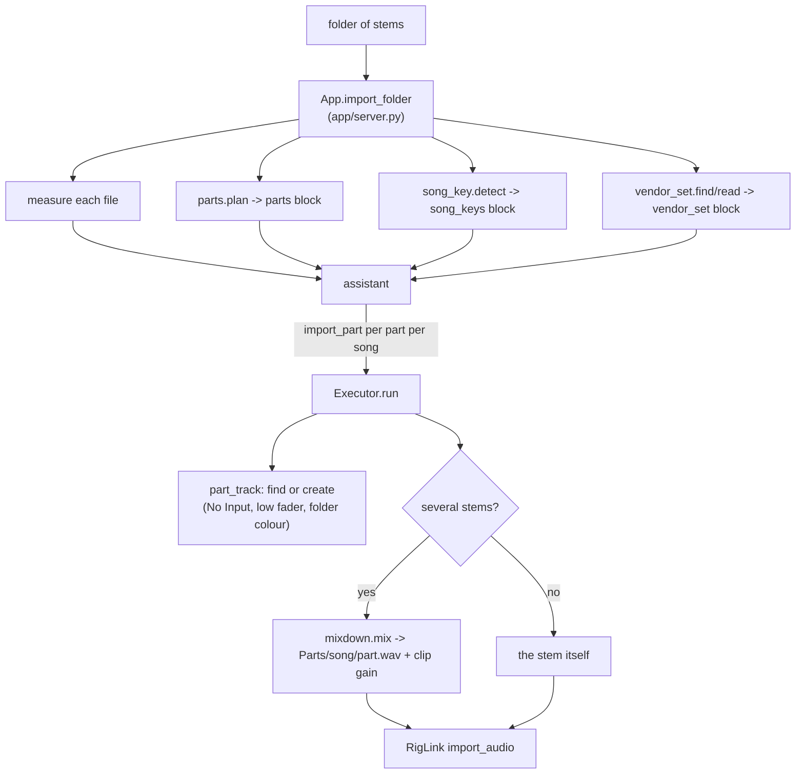

# Part tracks, imports, key and transpose

How audio gets from a folder of stems onto the church's fixed part tracks, and how a song's key and mix are handled afterwards. Written for developers; the volunteer view is [Weekly workflow](weekly-workflow.md). The rules below are also in [CLAUDE.md](../../CLAUDE.md) under "Track layout rules" and are checked by `TrackLayoutGuardTest`.

## Why part tracks

A set once grew to 93 tracks for three songs because every vendor stem name got its own track, each with Live's default input. Now every song lands on the same ~20 part tracks, in the same order. Live allows one clip per track per song, so a part with several stems is mixed into one file.

Rules to keep when changing imports (these hold in `import_part`, `rig.py song import` and `tidy_into_parts`):

1. Every song uses the same part tracks. Never a track per stem.
2. The model cannot create stem sprawl: `import_audio` is not a proposable action; `import_part` is, and it creates a missing part track itself.
3. Playback tracks have No Input. RigLink's `create_audio_track` sets it; live sources set input explicitly afterwards.
4. A song's own level lives in its clips (clip gain); Live applies it when the song starts, app open or not. A part is left out of one song by muting it in that song. Faders, pan, mute and sends belong to the track, so they are per song only through the app (`app/song_mixes.py`, see [Per-song mix](#per-song-mix)); with no song picked, or the app closed, they are shared by every song.

## `app/parts.py`

`PARTS` is an ordered list of `(part name, regex)`; the first match wins, and the order is also the track creation order. Current parts, in order: Click, Guide, SMPTE, Loops, Drums, Perc, Synth Bass, Bass, Acoustic, Electric, Piano, Organ, Keys, Strings, Horns, Synths, FX, Lead Vocal, Choir, BGVs, Crowd. "Synth Bass" is checked before "Bass", and "Drum Loop" is Loops.

| Function | Does |
| --- | --- |
| `part_for(stem)` | The part a stem name belongs to, or `None`. |
| `plan(files)` | Groups one song's file ids into `{part: [ids]}` in part order. A stem that fits no part gets its own entry under its name, minus a trailing take number and an L/R suffix. |
| `pans(files)` | `{file id: -1, 0, 1}`: L/R stem pairs (via `live_control/stereo_pairs`) go to their side; everything else is centre. |
| `describe(song, grouped)` | The plan as text for the assistant (the `<parts>` block). |

## `app/mixdown.py`

`mix(sources, out_path)` sums stems into one WAV, stdlib only. `sources` is `[(path, gain_db, side)]` with `side` -1, 0 or 1. Stems are summed at the gain they arrive with, so the vendor's balance inside the part is kept. The sum is scaled to peak at -1 dBFS (`PEAK_DBFS`) and written as 24-bit PCM. It returns `{path, channels, seconds, gain_db}`; `gain_db` is how much the sum was scaled, and callers put the opposite back as **clip gain** so the part plays as loud as its stems did together. It reads with `audio_files`' WAV/AIFF reader. Different sample rates raise `MixdownError`. Originals are never touched. Output goes to `Executor.parts_dir`: `~/Music/Holy Sound/Parts/<song>/<part>.wav`, or `$HOLYSOUND_HOME/Parts` (`default_parts_dir`).

## Import paths

- **App.** The attachment sent with an import message holds the measurements plus `<parts>` (per song subfolder), `<song_keys>` and, if found, a `<vendor_set>` block. The assistant answers with one `import_part` per part per song. `Executor.part_track(part)` finds a track by exact name (any case) or creates it; a new one gets the batch's starting fader (`starting_fader_db` of the largest per-song `import_part` count), its folder's colour, and mute if it is timecode. `run_all` sets `new_track_fader_db` only when the batch has `import_part` steps.
- **CLI.** `rig.py song import FOLDER` does the same grouping on one folder: per part, reuse or create the track, mix if needed, `import_audio`. Level matching (`--match-levels`, default) happens per stem *before* mixing, so each stem is evened to the same loudness first. `--only` and `--bpm` still apply.
- **Imported folders** are remembered in `~/.holysound/imports.json` (folder name to file count, and file id to absolute path, saved as strings) so last week's folder need not be imported again. The assistant can only use files from those ids, never an arbitrary path.

## `app/tidy.py`: folding an old set

`tidy(ex, assign)` (action `tidy_into_parts`, CLI `rig.py track tidy [--assign ...] [--yes]`) reads the open set (`get_snapshot`, `list_scenes`, `song_files`) and groups each song's clips by part: `assign` (`(song or None, track, part)`, for tracks named after a singer) wins, then `parts.part_for(track name)`, else the track keeps its own name. For each song and part it drops sources that are switched off or on a muted track (timecode stays, muted on purpose), mixes the rest, deletes the part track's own old clip in that song, imports the result with `name=<part>` and the baked-in gain (clip gain plus the old fader, clamped to -70..+24 dB). Songs with no sound left in a part get the new clip switched off with `set_clip_active`. After each song it reapplies the song's transpose, skipping tracks that keep their key. At the end it sets each part track's fader to 0 dB, copies the output of the stem tracks that fed it when that was not Main, deletes the emptied stem tracks (highest index first), and returns sentences, including a list of effects that were not carried over. It is destructive and long-running; it is tagged `destructive` and is not transactional.

## `app/song_key.py`: key guess

Stdlib only. For 40 stretches (`SEGMENTS`) of each pitched stem it measures how strongly each of the 48 notes E2 to D#6 sounds, folds them into 12 note names, sums them across stems and correlates against the Krumhansl-Kessler major and minor profiles. Quiet stretches (below -45 dBFS) are skipped and each stretch counts equally, so one loud chorus does not decide. `pitched_stems` takes instruments that carry harmony (bass, keys, piano, organ, synth, pads, strings, guitars) and falls back to vocals only if nothing else is usable. `detect` returns `{key, tonic, mode, runner_up, clear, stems}` (`clear` means a 0.08 correlation lead) or `None`. It is a guess; the usual miss is the relative key, so the runner-up is always reported.

## `app/vendor_set.py`: vendor sets (read only)

One-song sets from Washed, MultiTracks and similar: every stem laid out in Arrangement view, sections as locators. `find(folder)` returns the one `.als` in the folder or its parent (none if there are zero or several). `read(path)` opens it gzipped or plain (50 MB decompressed cap, XML entities and network disabled) and returns tempo, whether it changes, sections as `(name, beat)`, tracks with the first clip's file, start, warped flag and pitch, and notes about layout. It handles Live 8 (sample path as `RelativePathElement` dirs plus `Name`; tempo as an automation event) and newer sets (`RelativePath`/`Path` values; tempo as `Manual`). The server only attaches it when at least half its tracks' files are among the imported ones. The file is never written. Facts are in CLAUDE.md's "Vendor sets (read only)".

## Per-song mix

Two layers:

- **In the clips.** `set_clip_gain` and `set_clip_active` edit one song's clip; Live applies both when the song starts, with or without the app. Snapshot clip rows carry `active`; the assistant's session notes mark a clip "OFF in this song". The mixer's Playing / Left out switch is per-song mute; it calls `set_clip_active` only to turn a switched-off clip back on. `delete_clip` empties a slot (used by tidy).
- **On the tracks, through the app.** Faders, pan, mute and sends belong to the track. `app/song_mixes.py` (`SongMixMemory`, `~/.holysound/song_mixes.json`) keeps them per song by song and track name, puts them back when a song is picked in the mixer's **Song mix** picker or starts playing, and keeps up to 20 named checkpoints per song. Solo and the Master fader are not kept. Endpoint and behaviour: [web-server-api.md](web-server-api.md) (`/api/song-mix`); picker: [frontend.md](frontend.md).

## Transpose that keeps tempo

Transposing an unwarped clip also changes its speed (like tape; about 12% faster at +2, confirmed by ear in Live 12.4.6). So `transpose_song(scene_index, semitones, skip_tracks)` in RigLink:

- For every audio clip not in `skip_tracks`: turn warping on, set `warp_mode` to Complex Pro (6, read back after setting), keep the first warp marker pinned at (0 s, beat 0) and add one real marker so file second `s` sits at beat `s * bpm / 60`, set `end_marker`/`loop_end` to the file length in beats, set `pitch_coarse`.
- At 0 semitones the clip goes back to unwarped and sample-locked, with end markers reset to the file length in seconds.
- Tracks in `skip_tracks` are put back at their original key.
- The result has `clips`, `kept` and a per-clip `report` (any problems with the warp mode or markers are listed, not raised).

Which tracks keep their key comes from `FolderMemory.kept_tracks`: by default names matching click, guide, cue, count, SMPTE, timecode, LTC or metronome; a per-track choice (`follows_key` in `folders.json`, set via `POST /api/track-key`) overrides it and follows renames. The scene row's `transpose` is the shared non-zero `pitch_coarse` of the song's audio clips (kept tracks sit at 0 and do not count), `0` if none, `null` if they disagree. Callers: the assistant action, `/api/live` (the server fills in `skip_tracks`), and `rig.py song transpose`.
