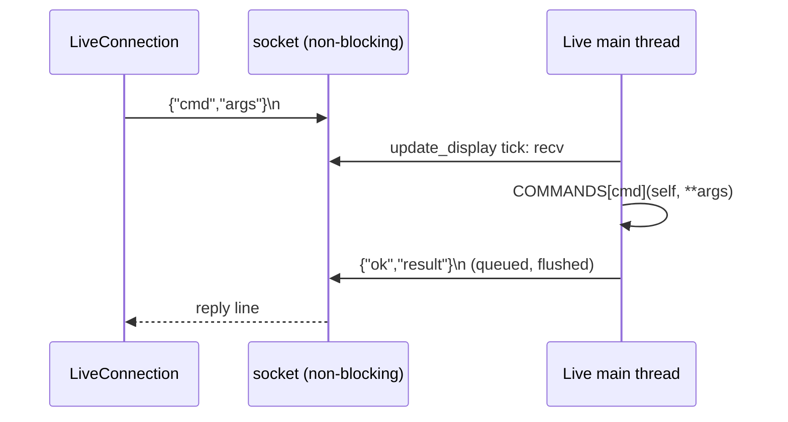

# RigLink

RigLink is a Live Control Surface (`ableton_script/RigLink/__init__.py`) that opens a local TCP socket inside Ableton Live and executes JSON commands against the open Set. `live_control/live_connection.py` (`LiveConnection`) is its Python client. It is the live-edit backend; see [architecture.md](architecture.md) for how it sits beside the [file renderer](file-renderer.md).

Callers: the [CLI](cli-and-live-control.md) (`rig.py`) uses `LiveConnection` directly; the web app goes through `app/live.py`, a shared self-reconnecting wrapper ([web-server-api.md](web-server-api.md), [assistant-and-actions.md](assistant-and-actions.md)).

## Installation

1. Symlink the folder into Live's Remote Scripts directory:
   `ln -s "$PWD/ableton_script/RigLink" ~/Music/Ableton/User\ Library/Remote\ Scripts/RigLink`
2. In Live: Preferences > Link/MIDI, pick **RigLink** in a Control Surface slot.
3. Live logs `RigLink: listening on 127.0.0.1:9877` (Live's `Log.txt`). On bind failure it logs `RigLink: failed to open socket: ...` and the script stays loaded but deaf.

**Restart-after-edit rule.** Live imports RigLink once at startup. After editing `ableton_script/RigLink/`, quit and reopen Live. Symptom of stale code: `unknown cmd: <name>` for a command that exists in the source. Edits to `live_connection.py`, `rig.py` or `app/` need no Live restart.

Constants: `HOST = "127.0.0.1"`, `PORT = 9877` (duplicated in `live_connection.py`). The socket is loopback only; there is no authentication.

## Threading model

There are no threads. Live's Python API is main-thread only, so RigLink never touches it from a background thread. Instead everything is driven from `RigLink.update_display()`, which Live calls on its main thread roughly every 100 ms (the client docstring says "a few times a second"). Each tick:

1. Sample every audio track's output meter (`_read_levels`) into two `MeterWindow`s.
2. `_accept_new_clients()`: non-blocking `accept()` loop.
3. `_service_clients()`: non-blocking `recv(4096)` per client, buffer, split on `\n`, call `_handle_line` for each complete line.
4. `_flush_clients()`: non-blocking `send` of queued replies. Replies that don't fit stay in `_outgoing[client]` and go out on later ticks.

Consequences:

- Each command runs synchronously on Live's main thread inside the tick, so a slow command (`load_device`, `import_audio`) blocks Live's UI.
- Round trip is about one tick (~100 ms) minimum. Hence `get_snapshot`: one call instead of a dozen.
- Multiple clients may connect (`listen(4)`); each has its own buffer and outbound queue.
- A command is handled to completion before the next line is read, so per-connection ordering is preserved.

## Wire protocol

Newline-delimited JSON over TCP, UTF-8, one request line gets exactly one reply line.

Request: `{"cmd": "<name>", "args": {<kwargs>}}` (`args` defaults to `{}`).

Success: `{"ok": true, "result": <any JSON>}`

Failure: `{"ok": false, "error": "<message>"}`

| Condition | `error` |
|---|---|
| Line isn't valid JSON / UTF-8 | `bad json: ...` |
| `cmd` not in `COMMANDS` | `unknown cmd: <cmd>` |
| Handler raised anything (`IndexError` for bad index, `LookupError`, `ValueError`, `TypeError` for wrong/missing args, `NotImplementedError`...) | `str(exception)` |

Handlers are called as `handler(rf, **args)`, so argument names in `args` must match the Python parameter names exactly; extra or missing keys surface as `TypeError` text. All exceptions are caught so a bad command cannot crash Live's event loop. Note a bad index raises Python `IndexError` text such as `list index out of range`; there is no bounds-check message. Blank lines are ignored. Replies are not correlated by ID; the client relies on strict request/response order.

`LiveConnection` raises `RigLinkError` for `ok: false`, and for a connection closed mid-reply. A refused connection raises `ConnectionRefusedError` from `socket.create_connection` (Live not running or RigLink not selected).

## Addressing

- **Tracks** are addressed by integer index into `song.tracks` (audio and MIDI, in Live's order), or into `song.return_tracks` when `is_return` is true (default false). Master has no index; only `get_snapshot` and `get_meters` report it.
- **Scenes** (the app's "songs") by index into `song.scenes`; **clips** by `(track_index, scene_index)`, i.e. the Session slot.
- **Locators** by index in time-sorted order (`_cues_by_time`), not Live's internal order.
- **Devices** by index into `track.devices`; stock devices are found by display name, case-insensitive (`_by_display_name`, `_find_device_item`).
- Indices are positional and shift when tracks or scenes are added or deleted; re-list after structural changes. `MeterWindow` resets itself when the (track, return) count changes for this reason.

## dB conversion by binary search

RigLink never uses a dB formula. `_set_db(param, db)` (volume, sends):

1. If the target is at or below what `str_for_value(param.min)` displays, set `param.min` (covers `-inf`).
2. Otherwise 40 bisection steps between `param.min` and `param.max`, comparing `_parse_db(param.str_for_value(mid))` to the target.
3. Set `param.value` to the upper bound and return the resulting display string (e.g. `"-6.0 dB"`).

`_parse_db` takes the first whitespace token of the display text, normalizes Unicode minus (U+2212), and `float()`s it (`"-inf"` works). Result is the nearest value Live can display at or above the request, so the returned string, not the request, is the truth. Clip gain (`_set_clip_gain_db`) does the same over `clip.gain` 0..1 using `clip.gain_display_string`, 30 steps. Pan is the one exception: it is clamped to `[param.min, param.max]` and set directly.

## Command reference

All 46 entries of `COMMANDS`. `is_return` (bool, default false) selects return tracks wherever shown. "Display string" means Live's own text, e.g. `"-6.0 dB"`.

### Connection and introspection

| Command | Params | Returns | Notes |
|---|---|---|---|
| `ping` | none | `"pong"` | Liveness check. No version info. |
| `api_names` | none | `{song: [...], track: [...]}` | Public attribute names of Song and first track; for probing what this Live exposes. |
| `get_snapshot` | none | See below | Whole set in one call. Newer than the other commands; clients fall back if `unknown cmd`. |
| `list_stock_devices` | none | `{audio_effects, midi_effects, instruments: [names]}` | Browser search depth 2. |

`get_snapshot` result: `song` (as `get_song`), `tracks[]` and `returns[]` (strips: `index, name, is_return, color, meter{peak,average}|null, volume, volume_db, pan, pan_value, mute, solo, sends[{return,level,level_db}], devices[names], output{type,channel}`; tracks add `is_midi, input{type,channel}, clips[{scene_index,name,is_audio,is_playing,length,gain,gain_db}]`), `master{volume,volume_db,meter}`, `scenes` (as `list_scenes`), `locators`, `ext_outputs` (Master's Ext. Out channel names, `[]` if Master isn't on Ext. Out). `*_db` is `null` for `-inf`. Meters are peak/average since the previous snapshot (uses the separate `_display_meters` window, which the call then resets).

### Tracks

| Command | Params | Returns | Notes |
|---|---|---|---|
| `list_tracks` | none | `[{index, name, is_midi}]` | |
| `list_returns` | none | `[{index, name}]` | |
| `create_audio_track` | `name=None` | `{index, name}` | Appended at end. |
| `create_midi_track` | `name=None` | `{index, name}` | |
| `create_return_track` | `name=None` | `{index, name}` | |
| `set_track_name` | `track_index, name, is_return` | `{index, name}` | |
| `delete_track` | `track_index, is_return` | `{index}` | Shifts later indices. |
| `set_track_color` | `track_index, rgb, is_return` | `{index, color, clips}` | `rgb` is an int; Live snaps to nearest palette colour. Also recolours session and arrangement clips (none for returns). |
| `track_contents` | `track_index, is_return` | `{devices, session_clips, arrangement_clips}` | Counts; for checking before delete. |

### Routing

| Command | Params | Returns | Notes |
|---|---|---|---|
| `get_routing` | `track_index, is_return` | `{output: side, input: side}` | `input` omitted for returns. `side = {type, channel, types[], channels[]}` (display names; the lists are the available options). |
| `set_routing` | `track_index, direction, type_name, channel_name=None, is_return` | the new `side` | `direction` is `"input"` or `"output"`. Names matched case-insensitively against display names; error lists the options. Channel list depends on type, so it is validated after switching; on a bad channel the previous type and channel are restored. |

### Mixer

| Command | Params | Returns | Notes |
|---|---|---|---|
| `get_mixer` | `track_index, is_return` | `{volume, pan, mute, solo, sends[{return, level}]}` | Display strings. |
| `set_volume` | `track_index, db, is_return` | `{volume}` | Binary search, see above. |
| `set_pan` | `track_index, pan, is_return` | `{pan}` | -1..1, clamped. |
| `set_mute` | `track_index, on, is_return` | `{mute}` | |
| `set_solo` | `track_index, on, is_return` | `{solo}` | |
| `set_send` | `track_index, return_index, db, is_return` | `{level}` | `return_index` indexes `mixer.sends`. |

### Devices

| Command | Params | Returns | Notes |
|---|---|---|---|
| `list_presets` | `device_name` | sorted `[preset file names]` | Names include `.adv`. |
| `load_device` | `track_index, device_name, preset=None, is_return` | `{track_index, device, preset}` | Selects the track, then `browser.load_item`. Preset match ignores case and `.adv`. Searches only audio_effects, midi_effects, instruments (not Sounds/Drums), to depth 2. Appends to the device chain; blocks Live while loading. |
| `list_devices` | `track_index, is_return` | `[{index, name, class_name, is_rack}]` | |
| `delete_device` | `track_index, device_index, is_return` | `{index, name}` | |

### Meters

| Command | Params | Returns | Notes |
|---|---|---|---|
| `reset_meters` | none | `{reset: true}` | Clears the measurement window used by `get_meters`. |
| `get_meters` | none | `{ticks, tracks[{kind, index, name, has_audio_output, peak, average, samples}]}` | `kind` is `track`, `return` or `master`. Values are Live's 0..1 post-fader output meter (max of L/R) sampled each tick since the last reset; mapping to dBFS is unverified. Per CLAUDE.md, first-play readings are unreliable. |

### Audio clips

| Command | Params | Returns | Notes |
|---|---|---|---|
| `import_audio` | `track_index, file_path, scene_index, name=None, gain_db=None` | `{name, gain, length, warping, looping}` | Audio tracks only (`is_return` not accepted). Errors if the slot has a clip, or if Live lacks `create_audio_clip` (`NotImplementedError`). Sets warping off, looping off, `loop_start`/`start_marker` to 0, clip colour to the track's. |
| `set_clip_gain` | `track_index, scene_index, db` | `{gain}` | `LookupError` if the slot is empty. |
| `clip_markers` | `scene_index` | `[{index, name, start_marker, end_marker, loop_start, loop_end, length, warping, looping, sample_length, sample_rate, warp_markers?}]` | Diagnostic: checks stems line up. First 4 warp markers as `[sample_time, beat_time]`. |
| `song_files` | `scene_index` | `[{track_index, track, file_path}]` | Source file of each audio clip in a scene. Has no `LiveConnection` wrapper; callers use `send("song_files", ...)` (the app's `app/live.py` `call`). |

### Song, transport, scenes, locators

A "song" in the app is a Session scene. `scene row = {index, name, tempo|null, transpose}`; `tempo` only if the scene's tempo is enabled; `transpose` is the shared `pitch_coarse` of the scene's audio clips, `0` if none, `null` if they differ.

| Command | Params | Returns | Notes |
|---|---|---|---|
| `get_song` | none | `{tempo, is_playing, numerator, denominator}` | |
| `set_tempo` | `bpm` | `{tempo}` | |
| `play` / `stop` | none | `{is_playing}` | |
| `list_scenes` | none | `[scene row]` | |
| `create_scene` | `name=None, bpm=None` | scene row | Appended; `bpm` also enables scene tempo. |
| `set_scene` | `scene_index, name=None, bpm=None` | scene row | Only provided fields change. |
| `transpose_song` | `scene_index, semitones` | scene row + `clips` | Integer -12..12 else `ValueError`. Sets `pitch_coarse` on every audio clip. Effect on playback speed of unwarped stems is an open question (CLAUDE.md). |
| `count_scene_clips` | `scene_index` | int | Tracks (not returns) with a clip in that slot. |
| `delete_scene` | `scene_index` | `{index}` | |
| `fire_scene` | `scene_index` | `{index}` | Launches the scene. |
| `list_locators` | none | `[{index, name, time}]` | Time-sorted; `time` in beats. |
| `add_locator` | `time, name=None` | `{name, time}` | Moves the playhead to `time` and toggles a cue there (`set_or_delete_cue`); errors if one already exists within 1e-6. Leaves the playhead moved. |
| `delete_locator` | `locator_index` | `{name}` | Same playhead-toggle trick; also moves the playhead. |
| `jump_to_locator` | `locator_index` | `{name, time}` | |

## Version and capability detection

There is no version or capabilities command. `ping` returns only `"pong"`. Clients detect an old RigLink by calling a command and treating `unknown cmd: <name>` as "Live is running older code" (the usual cause is a Live that hasn't been restarted since an edit). Existing uses:

- `app/live.py` `_fetch_snapshot`: tries `get_snapshot`, on `unknown cmd` sets `_has_snapshot_cmd = False` and assembles the snapshot from many small calls.
- `app/server.py`: `song_files` `unknown cmd` becomes "Live is running an older RigLink. Quit and reopen Live, then try again."
- Field presence: `app/static/app.js` hides the key control when scenes lack `transpose`; `app/assistant.py` `_outputs_line` handles a snapshot without `ext_outputs`.

Within Live itself, features are probed with `hasattr`/`getattr` (`create_audio_clip`, `Scene.tempo_enabled` for Live 11+, `arrangement_clips`, `warp_markers`).

## LiveConnection client API

`LiveConnection(host="127.0.0.1", port=9877, timeout=5.0)` opens the socket in the constructor; it is a context manager. Not thread-safe; one command in flight. `send(cmd, **args)` is the generic call and returns `result` or raises `RigLinkError`. Every method below is a one-line wrapper over `send` with the same name and parameters as the command table, and returns that command's `result` unchanged.

| Method | Command |
|---|---|
| `ping`, `list_tracks`, `list_returns`, `api_names`, `reset_meters`, `get_meters`, `get_song`, `play`, `stop`, `list_scenes`, `list_locators`, `get_snapshot`, `list_stock_devices` | same name, no params |
| `create_audio_track`, `create_midi_track`, `create_return_track` | `(name=None)` |
| `set_track_name`, `delete_track`, `set_track_color`, `track_contents` | `(track_index, ..., is_return=False)` |
| `get_routing`, `set_routing` | `(track_index, [direction, type_name, channel_name=None], is_return=False)` |
| `get_mixer`, `set_volume`, `set_pan`, `set_mute`, `set_solo`, `set_send` | `(track_index, ..., is_return=False)` |
| `list_presets`, `load_device`, `list_devices`, `delete_device` | as command table |
| `import_audio`, `set_clip_gain`, `clip_markers` | as command table |
| `set_tempo`, `create_scene`, `set_scene`, `transpose_song`, `count_scene_clips`, `delete_scene`, `fire_scene` | as command table |
| `add_locator`, `delete_locator`, `jump_to_locator` | as command table |

Not wrapped: `song_files`. Optional args are always sent (as `null` when `None`); RigLink's handlers treat `None` as unset.

Keep in mind: `send` writes a request then blocks reading until a newline, and the 5 s timeout applies to each socket operation. `load_device` or a large `import_audio` can approach that. `app/live.py` adds locking and reconnection on top.

## Known limitations

- No record-arm, monitoring, effect parameters, rack internals, plugins, User Library presets, MIDI mapping, group tracks (see `docs/td_next.md`).
- Device loading searches only stock effects and instruments, depth 2; it appends and cannot choose position. `load_device` changes Live's selected track.
- `import_audio` targets Session slots on audio tracks only.
- Locator add/delete move the playhead.
- Meter units to dBFS unverified; first-play readings are bogus (memory notes).
- Hardware output routing channels are only listed relative to the current output type; `ext_outputs` reads them from Master.
- Stale-code failure mode after editing RigLink: needs Live restart.
- Error messages from bad indices are raw Python text.
- Loopback only, no auth, no request IDs, no protocol version.
- Unverified: whether `transpose_song` alters speed of unwarped stems.

## Discrepancies

- `CLAUDE.md` says RigLink commands cover "record-arm and monitoring" as missing, consistent with code. It describes `live_connection.py` as covering "RigLink"; the client wrappers are missing `song_files` although the docstring says "one per command in RigLink.COMMANDS".
- Module docstring in `RigLink/__init__.py` says command vocabulary "matches RigSpec", but CLAUDE.md (and the code: scenes, locators, clips, meters) shows it has run ahead of the spec.
