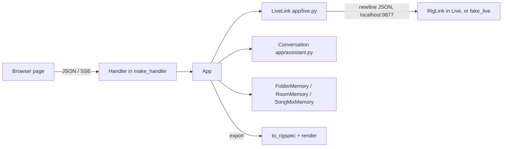

# Web server and API

The web app is a stdlib `http.server` process (`app/server.py`) that serves static files from `app/static/`, exposes a small JSON API over Live and the assistant conversation, and streams assistant replies over server-sent events. Live access goes through one shared, self-healing RigLink connection (`app/live.py`); `app/fake_live.py` stands in for Live when there is none.

Related pages: [architecture.md](architecture.md), [riglink.md](riglink.md), [cli-and-live-control.md](cli-and-live-control.md), [assistant-and-actions.md](assistant-and-actions.md), [part-tracks-and-imports.md](part-tracks-and-imports.md), [file-renderer.md](file-renderer.md), [frontend.md](frontend.md), [testing-and-development.md](testing-and-development.md).

## Starting it

Run from the repo root (`app/__main__.py` just calls `app.server.main()`):

```
uv run python -m app                 # this computer only, http://127.0.0.1:8765/
uv run python -m app --lan           # also phones/tablets on the same Wi-Fi
uv run python -m app --fake-live     # pretend Live Set, no Ableton needed
uv run python -m app --list-models   # print OpenCode Go models, then exit
```

| Flag | Effect |
| --- | --- |
| `--port N` | HTTP port. Default `DEFAULT_PORT = 8765`. |
| `--lan` | Binds `0.0.0.0` instead of `127.0.0.1` and generates a random access key (see [Access control](#access-control)). Prints `http://<lan ip>:<port>/?key=<key>`. |
| `--fake-live` | Starts `fake_live.serve(port=0)` in-process on an ephemeral port and points `LiveLink` at it. Sets `App.demo = True`, which is reported in `/api/state` as `demo`. |
| `--no-browser` | Skip the `webbrowser.open` call (otherwise fired 0.5 s after start). |
| `--list-models` | Calls `app.providers.list_models_text()`, prints, exits. |

Environment: `load_dotenv()` reads `.env` from the repo root with `os.environ.setdefault` (real env wins; no dependency). Variables used by the server and its neighbours:

| Variable | Used by |
| --- | --- |
| `ANTHROPIC_API_KEY`, `HOLYSOUND_MODEL`, `HOLYSOUND_EFFORT`, `HOLYSOUND_PROVIDER`, `OPENCODE_API_KEY`, `HOLYSOUND_BASE_URL` | `app/providers.py` (see [assistant-and-actions.md](assistant-and-actions.md) and `.env.example`) |
| `HOLYSOUND_HOME` | Directory for `room.json`, `folders.json`, `song_mixes.json`; `imports.json` sits next to `room.json`. Default `~/.holysound`. Mixed parts go to `$HOLYSOUND_HOME/Parts` (default `~/Music/Holy Sound/Parts`). |

The server is `ThreadingHTTPServer` with `daemon_threads = True`. Real Live is always expected at `127.0.0.1:9877` (`LiveLink` defaults); only `--fake-live` changes the port. There is no flag to point at a different Live host.

## Components



- `App` holds all state and logic; `make_handler(app)` returns a `BaseHTTPRequestHandler` subclass closed over it. Handlers contain routing only.
- `App.state()` is the single payload most endpoints return. Keys: `live` (`connected`, `snapshot`, `message`), `ai` (`ready`, `message`), `chat` (transcript, proposals expanded via `describe_proposal`), `busy`, `usage`, `colors`, `folders`, `room`, `activity`, `demo`, `song_mix` (see [Song mixes](#song-mixes)), `applying` (see [Apply progress](#apply-progress)).
- `activity` lists tracks the assistant touched in the last `AI_GLOW_SECONDS` (3 s); `App.touch` is passed to `run_all` as `on_touch`.
- Snapshot tracks get a `folder` field and a `keeps_key` field (true if a song transpose leaves the track alone) added by `App.with_folders` (see [audio-analysis-and-memory.md](audio-analysis-and-memory.md)).
- `App` takes a `parts_dir` (where mixed parts are written; `None` means the default above) and passes it to `run_all`. Imported folders are remembered in `imports.json` (folder name to file count, and file id to path, saved as strings) and loaded at start.

## Access control

- Loopback clients (`client_address` is loopback) are always allowed.
- Non-loopback clients need cookie `hs_key` equal to `app.key` (constant-time compare). `app.key` exists only with `--lan`; without it only localhost can connect, and the socket is not even bound to the LAN.
- First visit: `GET /?key=<key>` from a non-authorised client sets `hs_key` (HttpOnly, SameSite=Strict, one year) and 303-redirects to `/`. Wrong or missing key on `/` gives a 403 plain-text sentence; other paths give 403 JSON `{"error": "Not allowed."}`.
- POSTs also require `Origin` (if sent) to match `Host`, and `Content-Type: application/json` (else 415).
- Request bodies over 64,000 bytes are refused.

## Endpoint reference

All API responses are JSON with `Cache-Control: no-store` unless noted. Errors are always `{"error": "<sentence>"}`.

### GET

| Path | Response | Errors |
| --- | --- | --- |
| `/` and any other path | Static file from `app/static/` (`/` serves `index.html`). See [Static files](#static-files). | 404 plain text `Not found.` |
| `/api/state` | `App.state()` | none from Live: a Live outage is reported inside `live`, not as an HTTP error |
| `/api/events` | `text/event-stream` of assistant reply events (below) | none; ends when the client disconnects |
| `/api/presets?device=<name>` | `{"presets": [...]}` via RigLink `list_presets` | 400 if Live unreachable or RigLink rejects the device |
| `/api/devices` | `{"devices": {...}}` via `list_stock_devices`; `null` if RigLink can't say (older RigLink) | 400 if Live unreachable |
| `/api/folders?path=<dir>` | `audio_files.browse(path)` (folder listing for the import picker; no `path` = start location) | 400 `AudioFileError` text |
| `/api/proposals/<id>/export` | `.als` download: `application/octet-stream`, `Content-Disposition: attachment; filename="Holy Sound.als"` | 400 if proposal gone, has no `add_track`, or the renderer cannot find Live's library |
| `/api/proposals/export-notes?id=<id>` | `{"notes": [...]}`: what `to_rigspec` could not carry into a file. `[]` if the id is unknown. | none |

Note that on GET, `UserError`, `LiveUnavailable` and `RigLinkError` all map to HTTP 400 (not 503).

#### `/api/events`

Streams `event: <kind>\ndata: <json>\n\n` from `app.chat.feed` (`ReplyFeed`, see [assistant-and-actions.md](assistant-and-actions.md)). Kinds seen in the feed: `start`, `end`, `step`, `thinking`, `text`, `tool`. A `: still here` comment is written every `KEEP_ALIVE = 15` s of silence. The cursor is taken before headers are sent so no event is missed. The finished turn arrives via `/api/state`, not here. Access logging skips `/api/state` and `/api/events`.

### POST

All bodies are JSON objects (`{}` is assumed when empty).

| Path | Request body | Response | Errors |
| --- | --- | --- | --- |
| `/api/chat` | `{"message": str}` | `App.state()` after the assistant finishes (the call blocks for the whole turn) | 400 empty message; 400 if `chat.busy`; 503 `AssistantUnavailable` (no API key etc.) |
| `/api/import` | `{"folder": str, "note"?: str}` | `App.state()` | 400 empty folder / no audio found / unreadable folder / busy; 503 as above. Sends the assistant the measurements plus `<parts>`, `<song_keys>` and, if matched, a `<vendor_set>` block (`App.import_folder`, `song_keys`, `vendor_song`). |
| `/api/room` | `{"add"?: str, "remove"?: int}` | `App.state()` | 400 if memory unavailable |
| `/api/track-folder` | `{"track": str, "folder": str\|null}` | `App.state()` | 400 missing track or invalid folder |
| `/api/track-key` | `{"track": str, "follows": bool}` | `App.state()` | 400 "Say which track." if `track` is empty. Saves whether a song transpose moves this track (`FolderMemory.set_follows_key`). |
| `/api/song-mix` | `{"action": "pick", "scene_index": int\|null}`, `{"action": "checkpoint", "label"?: str}`, `{"action": "restore"\|"delete", "id": str}` | `App.state()` | 400 unnamed song, no song picked, checkpoint gone |
| `/api/eq-flat` | `{"track": str}` | `App.state()` | 400 "Say which track." if empty; 400 with the action's sentence if it fails. The channel drawer's Flat button: runs a `set_eq` action with `flat_first` (`App.eq_flat`, under `_apply_lock`), so it adds EQ Eight if missing and lands in the current song's mix. |
| `/api/reset` | `{}` | `App.state()` after `chat.reset()` | none |
| `/api/proposals/<id>/apply` | `{}` | `App.state()` after every step has run (the call blocks; see [Apply progress](#apply-progress)) | 400 if proposal missing or not pending; 503 if Live unreachable |
| `/api/proposals/<id>/dismiss` | `{}` | `App.state()` | 400 as above |
| `/api/live` | `{"cmd": str, "args"?: object}` | `{"result": <RigLink result>, "live": <live_state>}` | 400 `The app can't do that from here.` if `cmd` is not in `DIRECT_COMMANDS`; 400 on bad args or RigLink error; 503 Live unreachable |
| anything else | n/a | n/a | 404 `Not found.` |

`/api/live` is the mixer's direct line, bypassing the assistant. Whitelist (`DIRECT_COMMANDS`): `set_volume`, `set_pan`, `set_mute`, `set_solo`, `set_send`, `set_tempo`, `play`, `stop`, `fire_scene`, `load_device`, `delete_device`, `set_track_name`, `create_scene`, `set_scene`, `set_routing`, `create_audio_track`, `create_midi_track`, `create_return_track`, `get_routing`, `set_track_color`, `set_clip_gain`, `set_clip_active`, `transpose_song`, `set_eq_band`. For `transpose_song` the server fills in `skip_tracks` itself from `FolderMemory.kept_tracks`, so click, guide and any track opted out keep their key. `args` are splatted as keyword arguments into `LiveLink.call`, so a wrong argument name surfaces as a `TypeError` and a 400 ("The page asked Ableton for something it didn't understand"). `set_track_name` also renames the track in `FolderMemory` so a manual folder move follows the track. `set_scene` with a name renames the song in `SongMixMemory`; `fire_scene` on a named song puts the mixer on that song's mix.

### Song mixes

`App.state()` carries `song_mix`: `{song, scene_index, saved_at, checkpoints: [{id, label, at}]}`. `pick_song_mix` puts a song's saved faders, pan, mute, sends and EQ (the first EQ Eight, band by band; adding or removing the device isn't per song) back through RigLink (only what differs, matched by track and return name), or saves the current mixer as the song's first mix. Every `live_state()` then runs `follow_mix`: if Live started a different song (the scene with the most playing clips), its mix goes on; otherwise the current mixer is saved to the picked song when it changed. Saving waits `MIX_SETTLE_SECONDS` after a put-back so a half-applied mix isn't saved. Restoring a checkpoint first checkpoints the mix it replaces. Solo and the Master fader aren't kept. `apply` passes the memory and the `App` itself (`mix_control`) to `run_all`, so the assistant's mixer actions with a `song` other than the current one edit that song's saved mix (`SongMixMemory.edit`) instead of Live, and `pick_song_mix`, `save_checkpoint` and `restore_checkpoint` are actions. `App.notes` passes every saved mix and its checkpoints to `session_notes`, which spells out each song's whole mix.

### Apply progress

`App.apply` sets `App.progress = {"id": pid, "states": [...]}`, one state per step, all starting `"waiting"`, and passes `run_all` an `on_step(n, state)` callback that updates them: `"working"` as a step starts, then `"done"`, `"check"` (it partly worked; the result has a " But ") or `"failed"`. If Live goes away mid-batch, that step and every one after it become `"failed"`. `App.applying()` copies this into `/api/state` as `applying: {"id", "states"}`, or `null` when nothing is running; `progress` is cleared in a `finally`, so it never outlives the call. The apply POST itself blocks until the batch ends, so the page reads progress by polling `/api/state` on another request (the server is threaded).

Apply is serialised by `App._apply_lock` (a laptop and a phone can both press Apply). After a proposal containing a `Listen` action, `App.apply` calls `chat.follow_up(self.notes())` so the assistant reads the measurements.

RigLink errors on POST are rephrased by `app.actions._sentence` ("Ableton has no input type called ...", "Ableton said: ..."); on GET they read "Ableton couldn't do that: ...". Any other exception, in GET or POST, is logged with its traceback and answered with a 500 `{"error": "Something went wrong inside Holy Sound. ..."}` (`_unexpected`); a dropped browser connection (`ConnectionError`) is re-raised, not answered.

### Examples

State (abridged), Live connected:

```json
{
  "live": {"connected": true, "message": null, "snapshot": {
    "song": {"tempo": 72.0, "is_playing": false, "numerator": 4, "denominator": 4},
    "tracks": [{"index": 0, "name": "1-Audio", "volume": "0.0 dB", "volume_db": 0.0,
                "pan": "C", "mute": false, "solo": false, "devices": [],
                "output": {"type": "Master", "channel": ""}, "folder": "other"}],
    "returns": [], "scenes": [], "locators": []}},
  "ai": {"ready": true, "message": null},
  "busy": false, "demo": false, "activity": []
}
```

State when Live is closed: `"live": {"connected": false, "snapshot": null, "message": "Can't reach Ableton Live. Make sure Live is open and RigLink is selected as a Control Surface in Settings → Link, Tempo & MIDI."}`.

Direct command:

```
POST /api/live
{"cmd": "set_volume", "args": {"track_index": 0, "db": -6}}
-> {"result": {"volume": "-6.0 dB"}, "live": {"connected": true, ...}}
```

Error:

```
POST /api/chat {"message": ""}   -> 400 {"error": "Type a message first."}
```

## Static files

`Handler._static` resolves the path under `app/static/` and requires the resolved target to be a file inside that directory (blocks `..` traversal; `STATIC not in target.parents` gives 404). MIME comes from `mimetypes`, `charset=utf-8` is appended for `text/*` and JavaScript, and `Cache-Control: no-cache` forces revalidation so edits show on reload. The exception is the vendored fonts in `app/static/fonts/`: `.woff2` is always served as `font/woff2` (the OS's MIME table varies) with `Cache-Control: public, max-age=86400`. No build step. Page internals are in [frontend.md](frontend.md).

## Shared RigLink connection (`app/live.py`)

`LiveLink` wraps `live_control.live_connection.LiveConnection` (one TCP socket, newline-delimited JSON, one command in flight; see [cli-and-live-control.md](cli-and-live-control.md) and [riglink.md](riglink.md)). One `LiveLink` is shared by every HTTP thread.

**Thread safety.** A single `threading.Lock` serialises every socket use. `call()` takes it; `snapshot()` takes it too, with a twist: a device load can hold the lock for seconds, so `snapshot()` first returns the cache if it is younger than `SNAPSHOT_MAX_AGE` (0.5 s), then tries `lock.acquire(timeout=0.2)`, and if it fails returns the last snapshot rather than queueing. Only if there is no snapshot yet does it block. `call()` zeroes `_snapshot_at` in a `finally`, so the next read after any command refetches.

**Lazy connect, reconnect on next call.** There is no background reconnect thread and no retry within a call.

| Event | Behaviour |
| --- | --- |
| No connection yet | `_connection()` opens `LiveConnection(host, port, timeout=30 s)`. `OSError` becomes `LiveUnavailable(NOT_CONNECTED)`. |
| Socket error, bad JSON (`OSError`, `ValueError`) during `send` | `_drop()` closes the socket and clears `_conn` and the stock-device cache; raises `LiveUnavailable`. Next call reconnects from scratch. |
| `socket.timeout` | Same drop; message is "Live stopped responding before it finished." |
| `RigLinkError` (Live replied `ok: false`) | Passed through; the connection stays up. |
| `LiveUnavailable` during `snapshot()` | Cached snapshot is cleared, so a stale mixer is never shown after Live goes away. |

The 30 s timeout exists because loading a device walks Live's browser tree.

**Snapshot.** `_fetch_snapshot` sends `get_snapshot`. If RigLink answers `unknown cmd` (an older RigLink still loaded in Live), `_has_snapshot_cmd` flips to `False` for the life of the process and `_assemble_snapshot` rebuilds it from `list_tracks`, `get_mixer`, `get_routing`, `list_devices`, `list_returns`, `get_song`, `list_scenes`, `list_locators`. The assembled form is slower (many round trips) and thinner: no `master`, no `color`, `meter`, `clips`, `ext_outputs`, `eq`, and `pan_value` is `None`.

**What happens when Live is closed.** `App.live_state()` catches `LiveUnavailable` and returns `connected: false` with the message; `/api/state` still returns 200, with chat and memory working. Actions that need Live return 503 (POST) or 400 (GET). Opening Live later needs no server restart: the next call connects. If Live is restarted (e.g. after editing RigLink), the old socket fails once, is dropped, and the call after that reconnects.

`stock_devices()` caches `list_stock_devices` until the connection drops; returns `None` on `RigLinkError`. `presets(name)` is uncached.

## Live-closed path: actions to `.als`

When there is no Live, the volunteer can still download a session file for a proposal. This path is not gated on Live being down; the endpoint works whenever the proposal exists.

1. `GET /api/proposals/<id>/export` calls `App.export(pid)`.
2. `app.actions.to_rigspec(actions)` keeps only `AddTrack` actions and builds `RigSpec(tracks=[TrackSpec(...)])` (name, kind, numeric input, device names, `volume_db` default 0, `pan` default 0). It returns `(None, notes)` if no tracks.
3. Anything it can't carry becomes a note (non-`AddTrack` actions, stereo inputs, non-Master outputs, colours, device presets, which fall back to defaults). Notes are fetched separately from `/api/proposals/export-notes` and are not in the download.
4. `file_builder.write_als.render(spec, TEMPLATE)` produces the bytes. `TEMPLATE` is `templates/test.als` (never mutated). `render` is imported lazily; a `LookupError` (Live's preset library not found) becomes a user sentence saying Ableton Live 12 must be installed.
5. A pending proposal is marked `exported` via `chat.record_outcome`. See [file-renderer.md](file-renderer.md) for the renderer.

## Fake Live (`app/fake_live.py`)

An in-memory Live Set speaking RigLink's newline-delimited JSON protocol on a TCP port, so the real `LiveConnection`/`LiveLink` code paths run unchanged.

- `FakeSet`: every public method is a RigLink command; `handle(request)` dispatches by `getattr` (names starting `_` and a few internals are refused as `unknown cmd`), wraps replies as `{"ok": true, "result": ...}` or `{"ok": false, "error": str(e)}`, and runs under one lock. Any exception becomes an error reply, mirroring RigLink.
- `serve(host, port, latency=0.05)` runs a `ThreadingTCPServer` on a daemon thread and returns `(server, fake_set)`. `port=0` picks a free port (read `server.server_address[1]`). `latency` sleeps before each reply to imitate Live answering from `update_display` at about 10 Hz. Tests pass `latency=0`.
- `python -m app.fake_live` runs it standalone on `127.0.0.1:9877`, so `rig.py` or a normally started app can talk to it.

Simulated: tracks (audio, MIDI, returns, with default A-Reverb and B-Delay returns), mixer (dB volume clamped to -70..+6, pan, mute, solo, sends), routing options (Ext. In, Master, Ext. Out etc.), stock devices and a few presets (`load_device` sleeps 0.3 s), scenes with tempo, locators, `import_audio` (reads the real file via `app.audio_files.measure`, so imports need real WAV/AIFF), `set_clip_gain`, `set_clip_active`, `delete_clip`, `move_scene`, `create_scene` at an index, `transpose_song` (with `skip_tracks`), `song_files`, EQ Eight per device (`get_eq`, `set_eq_band`, `eq` in snapshot strips; default bands as Live's factory default), fake meters (random jitter around a level derived from clip loudness, gain and fader), `get_snapshot`, play/stop/fire_scene.

Used by: `--fake-live` (demo mode), and `tests/test_app.py` (`FakeLiveCase` and others start `serve(port=0, latency=0)` per test). See [testing-and-development.md](testing-and-development.md).

Fidelity gaps (the module says it is "not a model of Live's behaviour"; do not record anything learned here as a format fact):

- Display strings imitate Live (`-6.0 dB`, `25L`, `C`); real values come from `str_for_value()`.
- Volume is stored as dB directly, with no fader law or binary search.
- Meters are random, with no first-play bogus readings like real Live.
- Device list is a fixed small set; real Live exposes the full browser and rack internals. Presets are a handful per device. Compressor/Reverb etc. do nothing.
- `transpose_song` only stores a number per clip (0 for skipped tracks); it does not model warping or speed. New audio tracks have No Input, as RigLink makes them.
- `import_audio` ignores warping/start-marker quirks; `delete_scene` and clip slots are simplified. There is no arrangement view; locators are a plain list.
- EQ Eight's type names are a stand-in (Live's come from `value_items`) and values are stored and clamped directly; nothing is heard.
- `get_snapshot` always exists, so the "older RigLink" fallback in `LiveLink` is never hit against the fake in demo mode.
- Nothing is persisted; state resets when the process ends.

## Discrepancies

- CLAUDE.md says that with Live closed, `add_track` actions become a RigSpec and download as `.als`. In code the export endpoint is independent of Live connectivity: it works any time, and the UI decides when to offer it.
- Not a CLAUDE.md conflict, but worth knowing: `app/server.py` imports `TRACK_COLORS` from the top-level `rig` CLI module (for the `colors` payload).
- GET errors from Live (`LiveUnavailable`) return HTTP 400, while POST returns 503; clients cannot rely on a single status for "Live is down".
